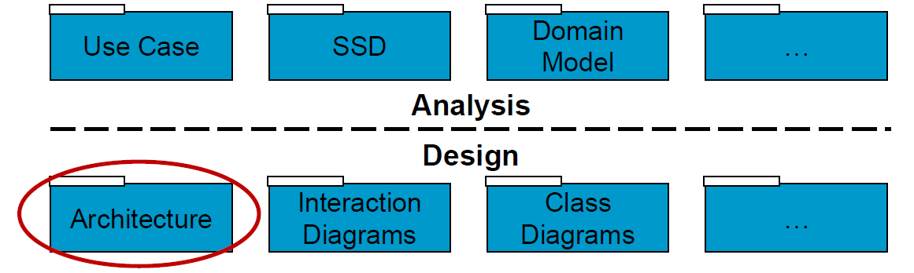
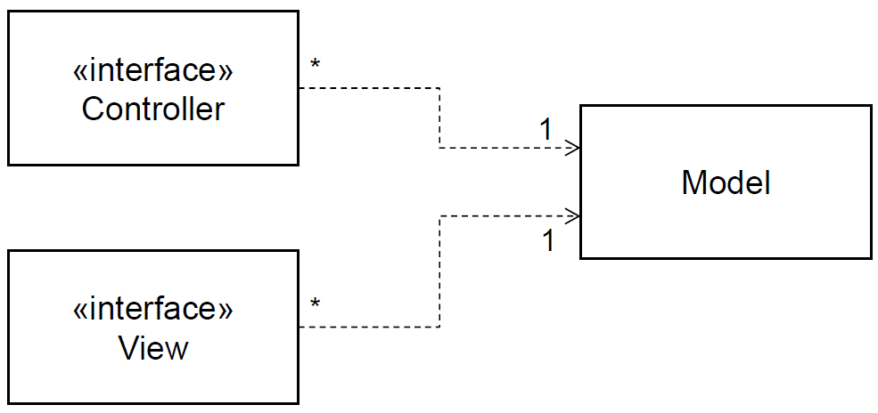
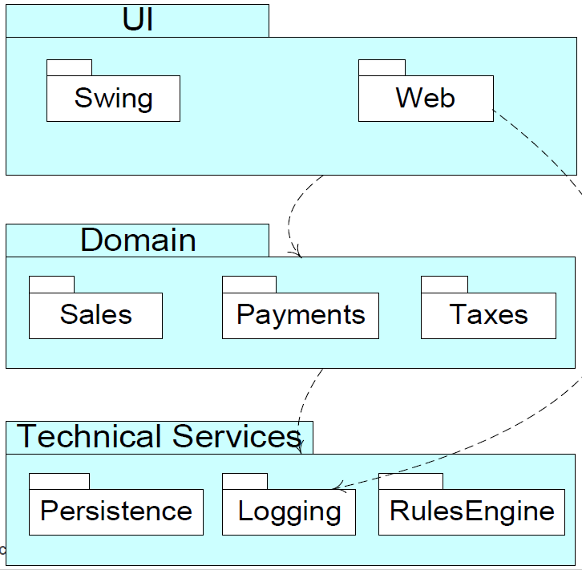
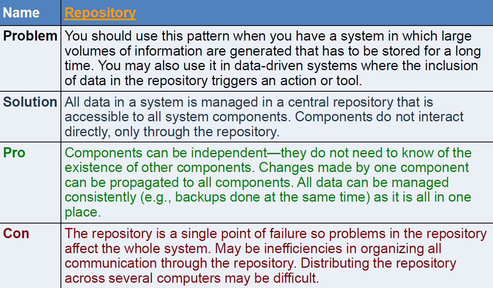
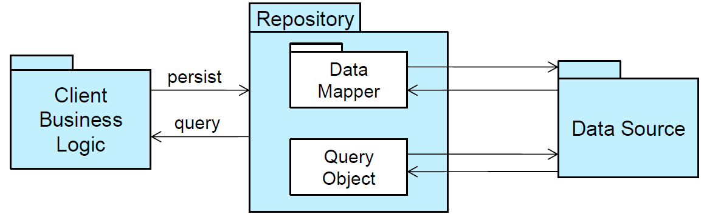
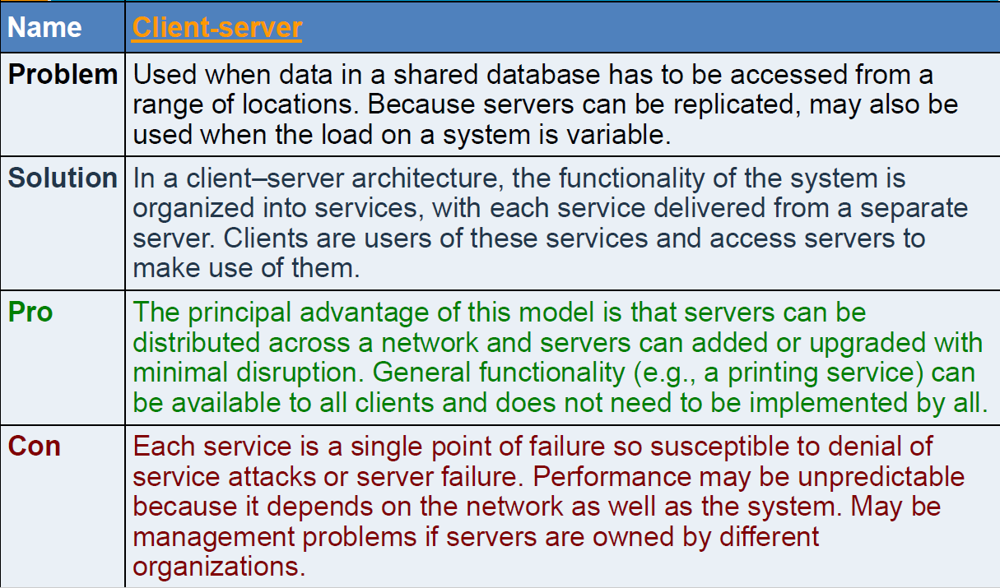
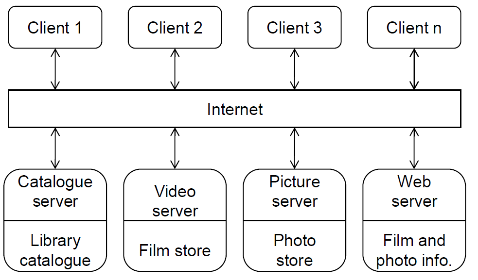
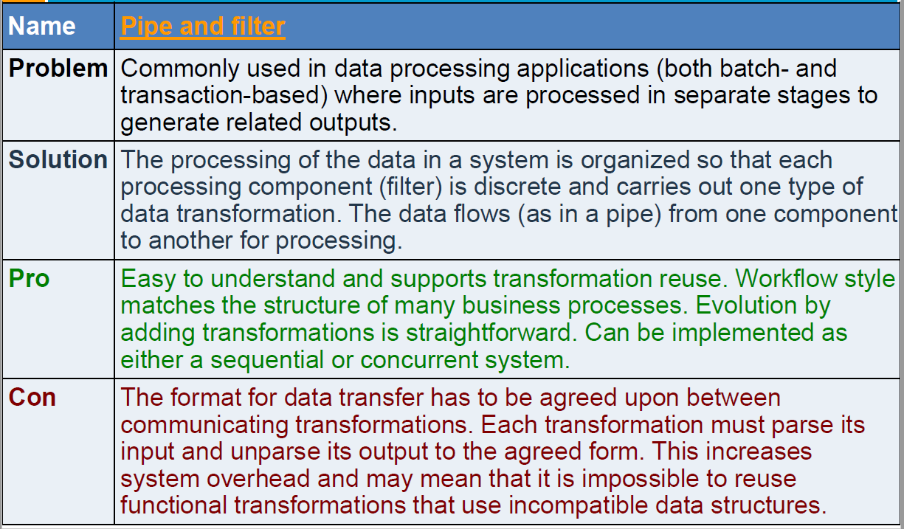

# Architecture & Patterns <!-- omit in toc -->
- [Architecture Centred Approach](#architecture-centred-approach)
    - [Requirements and Analysis leads to design](#requirements-and-analysis-leads-to-design)
    - [What is Software Architecture Then](#what-is-software-architecture-then)
    - [Architecture is the Important Stuff](#architecture-is-the-important-stuff)
- [Introducing Patterns](#introducing-patterns)
    - [Patterns are Encapsulated Experience](#patterns-are-encapsulated-experience)
    - [Patterns applied to Software Development](#patterns-applied-to-software-development)
    - [Original Idea is from (real) Architecture](#original-idea-is-from-real-architecture)
    - [Real v Software Architecture](#real-v-software-architecture)
    - [Aims of Software Patterns](#aims-of-software-patterns)
    - [Benefits of All Design Patterns](#benefits-of-all-design-patterns)
    - [Definition: Architectural Patterns](#definition-architectural-patterns)
- [Key Architecture Patterns](#key-architecture-patterns)
    - [Model-View-Controller (MVC) Pattern](#model-view-controller-mvc-pattern)
    - [Layered Architecture Pattern](#layered-architecture-pattern)
    - [Repository Pattern](#repository-pattern)
    - [Client-Server Pattern](#client-server-pattern)
    - [Pipe and Filter Pattern](#pipe-and-filter-pattern)
    - [Key Aim of these Patterns](#key-aim-of-these-patterns)
- [Layered Architecture](#layered-architecture)
    - [Advice: Multi-Tier Layered Architectures](#advice-multi-tier-layered-architectures)
    - [Layered Architecture](#layered-architecture)
    - [Simple Logical Architecture](#simple-logical-architecture)
    - [Advice: An Application Coordination Layer](#advice-an-application-coordination-layer)
    - [Model-View Separation Principle](#model-view-separation-principle)
    - [More Benefits of Layered Architecture](#more-benefits-of-layered-architecture)
    - [Reference Architectures](#reference-architectures)
    - [OSI Model for Distributed Systems](#osi-model-for-distributed-systems)
    - [Internet Stack (TCP/IP Model)](#internet-stack-tcpip-model)
    - [Layering Considered Harmful (?)](#layering-considered-harmful)
    - [Basic Web 2.0 Reference Architecture Diagram](#basic-web-20-reference-architecture-diagram)
- [Patterns and Concurrency](#patterns-and-concurrency)
    - [Parallel Agent and Repository](#parallel-agent-and-repository)
        - [Client-Server and Peer-to-Peer Architecture](#client-server-and-peer-to-peer-architecture)
        - [Pipeline or Pipe and Filter Pattern](#pipeline-or-pipe-and-filter-pattern)
            - [Pipes and Filters in Parallel](#pipes-and-filters-in-parallel)
- [Conclusion](#conclusion)
    - [Realizing Non-functional Requirements](#realizing-non-functional-requirements)
    - [Architecture Diagrams](#architecture-diagrams)
    - [Purpose of Architecture: beforehand](#purpose-of-architecture-beforehand)
    - [Use of Architectural Models after Development](#use-of-architectural-models-after-development)
- [Resources](#resources)
# Architecture Centred Approach
* We place an emphasis on design
    * Design pervades engineering activities
    * Important aspect of Computer Science
* An incorrect interpretation of the Agile Development leads to inadequate levels of architectural design information
* Architecture Decisions are system-wide Strategic Decisions
    * Choice of programming paradigm, e.g.: Object-orientation
    * Choose overall architectural pattern
    * Choice of API(S)
* Local detailed tactical decision e.g.: algorithms are left for later

## Requirements and Analysis leads to design

* At first we are investigators learning about a problem
* Then we change roles and become designers producing a working solution
* (and then we change back iteratively!)
## What is Software Architecture Then
* Software architecture -> *large scale*
    * big ideas
        * motivations
        * constraints
        * organisation
        * patterns
        * responsibilities
        * connections
    * Very interested in the non-functional requirements
        * also called quality requirements
        * e.g.: security, persistence, usability, etc
        * ensure that these can be met
        * or if cannot be met, suggest trade-offs
        * e.g.: trends vs costs vs time vs usability vs security
## Architecture is the Important Stuff
1. Expert developers understanding of the system design
2. The set of design decisions that must be made early on
    * Decisions that are hard to change
    * The important stuff 
        * Whatever that is
# Introducing Patterns
* Think about your own programming style
    * A large portion of it is most likely the way you structure your solutions, rather than the minute details of your code
    * If you could reuse the structure from one project to the next, you would gain all the benefits of reuse
* IT designer community has a growing body of past computer solutions for ideas and inspiration
* Best described using patterns
## Patterns are Encapsulated Experience
* Software design does not begin with an empty slate
* A new design is based on experience of previous 'similar' designs
* Software Design Patterns (SDP) attempt to guide new design with insight into typical problems
* They attempt to encapsulate the basic approaches for similar types of problems
## Patterns applied to Software Development
* The idea of named patterns for software originated with Kent Beck (eXtreme Programming guy) in the mid 1980s
* Software patterns really popularized with book:
    * *Design Patterns: Elements of Reusable Object-Oriented Software* by Gamma, Helm, Johnson, and Vlissides
        * Frequently referred to as the *Gang of Four* (GoF)
## Original Idea is from (real) Architecture
* Christopher Alexander, an architect, captured solutions to recurring problems
    * These problems and solutions were described as patterns
> Each pattern describes a problem that occurs over and over again in our environment and then describes the core of the solution to that problem in such a way that you can use this solution a million times over without ever doing it the same way twice
> Each pattern is a three-part rule, which expresses a relation between a certain context, a problem and a solution
* **Definition** a pattern is a solution to a problem in a context
## Real v Software Architecture
* Software is not embedded in space
    * Often no constraining physical laws
    * Software is (infinitely) malleable
* Software has no obvious representation
    * E.g.: no familiar geometric shapes
* Software does stuff - it is active
## Aims of Software Patterns
* The aim is to enhance reusability of object-oriented code
    * Well-structured object-oriented systems have recurring patterns of classes and objects
    * Knowledge of the patterns that have worked in the past allows
        * A designer to be more productive
        * The resulting designs to be more flexible and reusable
## Benefits of All Design Patterns
* Capture expertise and make it accessible to non-experts in an encapsulated design pattern
* Help communication amongst developers by providing a common language
    * Improve design understandably
* Make it easier to reuse successful designs and void alternatives that diminish reusability
* Facilitate design modifications
    * The design is more easily understood
* Improve design documentation
    * The system documentation starts with the UML design pattern
## Definition: Architectural Patterns
An *architectural pattern* is a set of architectural design decisions that are applicable to a recurring design problem, and parameterized to account for different software development contexts in which that problem appears.
* **Architecture Model**
    * An artefact documenting some or all of the architectural design decisions about a system
* **Architecture Visualization**
    * A way of depicting some or all of the architectural design decisions about a system to a stakeholder
* **Architecture View**
    * A subset of related architectural design decisions
# Key Architecture Patterns
## Model-View-Controller (MVC) Pattern
|  | Description |
|---|---|
|Problem|Used when there are multiple ways to view and interact with data. Also used when the future requirements for interaction and presentation of data are unknown |
|Solution|Separates presentation and interaction from the system data. The system is structure into three logical components that interact with each other. The Model component manages the system data and associated operations on the data. The View component defines and manages how the data is presented to the user. The Controller component manages user interactions (e.g.: key presses, mouse clicks, etc) and passes these interactions to the View and the Model|
|Pro|Allows the data to change independently of its representation and vice versa. Supports presentation of the same data in different ways with changes mode in on representation shown in all of them |
|Con| Can involve additional code and code complexity when the data model and interactions are simple |

## Layered Architecture Pattern
|  | Description |
|---|---|
|Problem | Used when building new facilities on top of existing systems; when the development is spread across several teams with each team responsibility for a layer of functionality; when there is a requirement for multi-level security.|
|Solution|Organises the system into layers with related functionality associated with each layer. A layer provides services to the layer above it so the lowest-level layers represent core services that are likely to be used throughout the system|
|Pro| Allows replacement of entire layers so long as the interface is maintained. Redundant facilities (e.g.: authentication) can be provided in each layer to increase the dependability of the system|
|Con|In practice, providing a clean separation between layers is often difficult and a high-level layer may have to interact directly with a lower-level layer rather than through the layer immediately below it. Performance can be a problem because of multiple levels of interpretation of a service request as it is processed at each layer|

## Repository Pattern

## Client-Server Pattern

## Pipe and Filter Pattern

## Key Aim of these Patterns
* Cohesion
    * Degree to which communication takes place within the module
* Coupling
    * Degree to which communication takes place between the modules
* Minimize coupling while maximising cohesion
# Layered Architecture
## Advice: Multi-Tier Layered Architectures
* Separate presentation and application logic, and other areas of concern

## Layered Architecture
* Logical architecture organised into layers
    * Layer - very coarse-grained grouping of classes (or packages or subsystems) with cohesive responsibility for a major aspect of the system
* Relationship between layers
    * "higher" layers call services of "lower" layers
    * Strict Layered Architecture (SLA) - layer uses only layer directory below
    * Relaxed - can use several lower layers

s
## Simple Logical Architecture
* In the UML, the logical partitioning is illustrated with package diagrams

## Advice: An Application Coordination Layer
* One strategy is to have "application coordination layer" whose objects represent use cases.
    * They may also hold session state
> Can mix and match different architectural patterns
## Model-View Separation Principle
* Model == domain layer
* View is the User Interface (UI) layer
    * Model objects shouldn't have knowledge of View objects
    * Don't assign domain responsibility to View objects
* Better separation of concerns with lower coupling
    * When domain layer independent of UI layer, domain layer can b used with another UI layer
* Facilitates multiple views of a given model
    * Example: Application and web UIs for a given application
## More Benefits of Layered Architecture
* System easier to comprehend: each layer has specific purpose
* Facilitates 'high-cohesion' within layers and 'low-coupling' between layers
## Reference Architectures
* Idealized way of discussing and comparing domain-specific architectures
* They do not represent actual real systems
## OSI Model for Distributed Systems
* OSI stack is seven-layer model for open systems interconnection
    * Lower layers: physical interconnection,
    * Middle layers: data transfer
    * Upper layers: semantically meaningful application information
* Allows conformant systems to communicate with each other
* Each layer should depend on the layer below
* Performance problems with this layered approach
    * Vast physical differences between networks
* Well defined functional characteristics but not the non-functional
* Developers implement their own higher-level facilities and skip layers in the model
## Internet Stack (TCP/IP Model)
* Internet stack is similar layered networking stack to OSI
* Pre-dates OSI stack
## Layering Considered Harmful (?)
* Networking layering -> functions of each layer are carried out completely before protocol data unit is passed to the next layer
    * Optimization of each layer has to be done separately
    * Hides information that lower layers may need to optimize performance
    * Layered model (TCP/IP & ISO OSI) causes conflict:
        * Layer N may duplicate lower level functionality (hop-hop error recovery vs end-to-end error recovery)
        * Layers may need the same information (time stamp)
        * Layer N mau need layer N-2 Information (lower layer packet sizes)
    * Increased layering -> increased complexity (via inter-layer dependencies)
> It is always possible to agglutinate multiple separate problems into a single complex interdependent solution. In most cases this is a bad idea
> Agglutinate - combine to express compound ideas.
* Conclusion
    * Horizontal separation may be more cost-effective and reliable than vertical
## Basic Web 2.0 Reference Architecture Diagram
* **Resource** tier 
    * Capabilities or backend system (data or processing) that support services consumed over the internet
* **Service** tier
    * Packages resources as a service and controls what goes in and out
    * Application servers deploying SOAP, EJB, PHP, Rails, ASP
* **Connectivity** 
    * Means to reach service
    * Standards/protocols like XML over HTTP
* **Client** tier

# Patterns and Concurrency
## Parallel Agent and Repository
* Data-centred concurrency:
### Client-Server and Peer-to-Peer Architecture
* Internet Mediated Client-Server
    * Dominant architecture for internet
    * Add redundancy (server-farms or cloud)
    * Vulnerable to attack (DOS)
* Two-Tier Peer-2-Peer Architecture
    * Many devices perform server-functions
    * Any device that that is acting as a client is able to find server (with the assistance of other servers)
### Pipeline or Pipe and Filter Pattern
* Suitable for applications that require a defined series of independent computations to be performed on ordered data
    * Very useful if each computation can be done incrementally on the data
        * Then computations can proceed in parallel
* The pattern attempts to decompose the problem into a set of computations, or filters, with operations, called pipes to stream data from one process to another
    * The filters interact only via pipes
    * "pure" filters have.....
#### Pipes and Filters in Parallel
* The components of the pattern execute in parallel
* All filters and pipes are simultaneously active
    * they accept the data
    * but only filters operate on them
    * and send them to the next step
* Pipes synchronize the activity between filters
* [Diagram](#pipe-and-filter-pattern)

# Conclusion
## Realizing Non-functional Requirements
Per
## Architecture Diagrams
* Simple Block Diagrams
    * Simple, informal block diagrams showing
## Purpose of Architecture: beforehand

## Use of Architectural Models after Development

# Resources
Sommerville:
* Chapter 6 *Architectural Design* <- important
    * [Architectural Patterns for Control](https://ifs.host.cs.st-andrews.ac.uk/Books/SE9/Web/Architecture/ArchPatterns/index.html)
    * [Application Architectures](https://ifs.host.cs.st-andrews.ac.uk/Books/SE9/Web/Architecture/AppArch/index.html)
    * [Reference Architectures](https://ifs.host.cs.st-andrews.ac.uk/Books/SE9/Web/Architecture/RefArch.html)
* Chapter 13 *Dependability Engineering* 
* Chapter 20 *Embedded Systems*
* Chapter 28 *Application Architectures* -> [Here](docs/SommervilleChapter28.pdf)

Bennet, McRobb & Farmer
* Chapter 13 *System Design and Architecture*
* Chapter 15 *Design Patterns* 

* Partha Kuchana, *Software Architecture Design Patterns in Java*
* Monroe, R.T., Kompanek, A., Melton, R., Garlan, D., *Architectural styles, design patterns and objects* -> [Here](https://ieeexplore.ieee.org/document/566427/)
* Mary Shaw. 1996. *Some patterns for software architectures*. In Pattern Languages od Program design 2. -> [Here](docs/PatternsForSoftwareArchitecture.pdf)