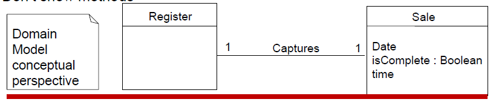
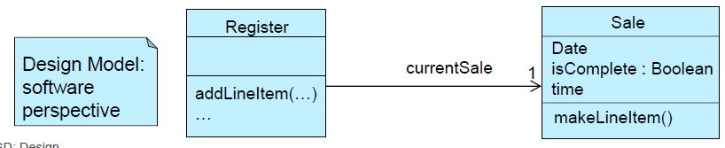
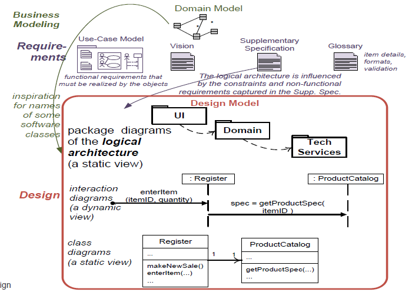
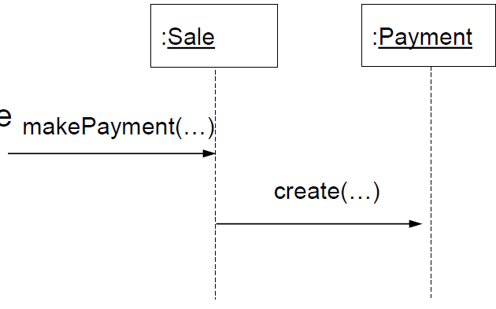
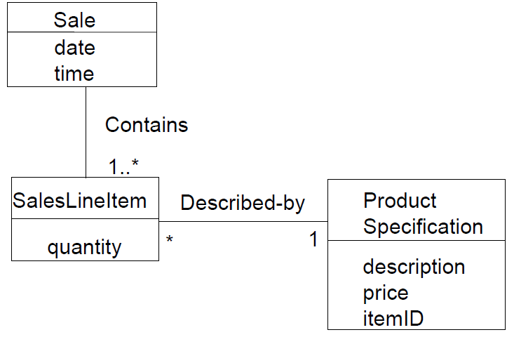
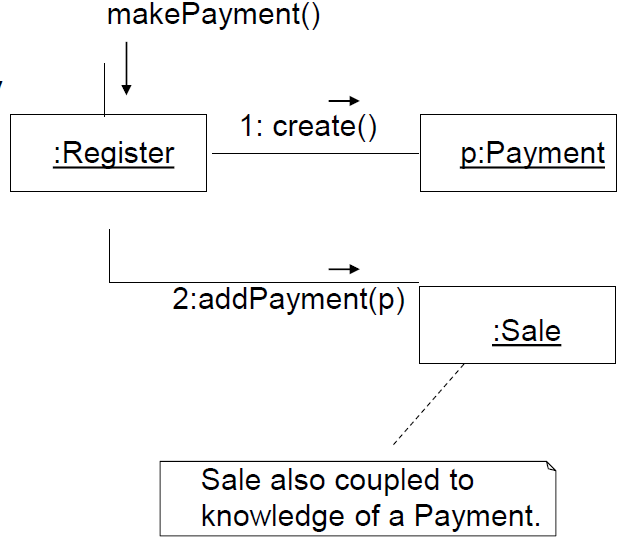
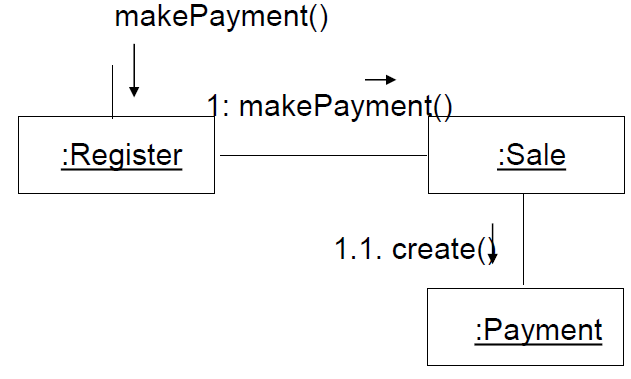

# Design Patterns
## Class Design and Unified Process Terminology
* Typical information in a Design Class Diagram includes:
    * Classes, associations and attributes
    * Interfaces (with operations and constants)
    * Methods
    * Attribute type information
    * Navigability
    * Dependencies
* The Class Design depends upon the Domain Model and interaction diagram
* The UP defines a Design Model which includes interaction and class diagrams
## Domain Model versus Design Model
* Domain Model is the analysis class diagram
* Don't show methods

* Design Model shows methods and visibility (arrowhead on association)
* Register has reference to Sale; Sale des not have reference to Register

## Sample UP Artefact Relationships

# Responsibility-Drive Design
* RDD: software objects have responsibilities (an abstraction)
    * *a Sale is responsible for creating SalesLineItems* (doing)
    * *a Sale is responsible for knowing its total* (knowing)
* Metaphor for thinking about OO design
* Big responsibilities take lots of classes and methods
    * "provide access to relational database"
        * Subsystem with 100 classes and 1000 methods
* Small responsibilities may take one method
    * "Create a sale" - one method in one class
* A responsibility is not a method, but methods fulfil responsibilities
## Responsibilities and Methods
> Object design is about identifying classes and objects, and their methods, and how they interact.
* Responsibilities relate to the obligations of an object
* Two types of responsibilities
    * Doing
        * Doing something itself (e.g.: creating an object, doing a calculation)
        * Initiating action in other objects
        * Controlling and coordinating activities in other objects
    * Knowing
        * Knowing about private encapsulated data
        * Knowing about related objects
        * Knowing about things it can derive or calculate
## RDD and Collaboration
* Responsibilities are implemented with methods that either act alone or collaborate with other methods and objects.
    * The *Sale* class might define one or more methods to know its total; say, a method named getTotal
    * The *Sale* may collaborate with other projects, such as sending a *getSubTotal* message to each *SalesLineItem* object asking for its subtotal
## Definition: Responsibilities
* Responsibilities are an abstraction
    * The responsibility for persistence
        * Large-grained responsibility
    * The responsibility for the sales tax calculation
        * More fine-grained responsibility
* Responsibilities are implemented with methods in objects
    * 1 method in 1 object
    * 5 methods in 1 object
    * 50 methods across 10 objects
## Responsibilities and System Sequence Diagrams
* Within the analysis artefacts, a common context where these responsibilities (implemented as methods) are considered is during the creation of sequence diagrams
* Sale objects have been given the responsibility to create Payments, handled with the makePayment method

# GRASP
I don't quite *GRASP* this section.

* Design Objects with Responsibilities
    * A critical skill is designing or thinking in objects
    * This *can* be practiced based on explainable principles
* Question: What guiding principles to help us assign responsibilities?
    * One answer:
    * **G**eneral **R**esponsibility **A**ssignment **S**oftware **P**atterns - **GRASP**
        * Very fundamental, basic principles of object design
        * Patterns are named problem-solution pairs to common problems, typically showing a popular, robust solution
            * "Facade", "Information Expert"
        * They provide a *vocabulary* of design
## Patterns
* Principles (expressed in patterns) guide choices where to assign responsibilities
* A pattern is a named **description of a problem** and a **solution** that can be appied to new contexts;
    * it provides advice on how to apply it in varying circumstances
* For example:
    * Pattern_name: Information Expert
    * Problem: What is the most basic principle by which to assign responsibilities to objects?
    * Solution: Assign a responsibility to the class that has the information needed to fulfil it
### Four elements of Pattern Templates
* Name
    * Increases our vocabulary
    * Frequently see "Also Known As", AKA
        * Indication of a naming problem
* Problem
    * Describes problem, inherent trade-offs and context
* Solution
    * General description of how to solve the problem
        * abstraction of an entire family of similar solutions
* Consequences - usually required
    * Each solution has trade-off and consequences
    * Solutions can cause or amplify other problems
        * Costs and benefits should be compared against
## Nine Grasp Patterns
1. Information Expert (expert)
2. Creator
3. Controller
4. Low Coupling
5. High Cohesion
6. Polymorphism
7. Pure fabrication
8. Indirection
9. Protected Variations (don't talk to strangers)
### Information Expert
AKA - Expert
* What is most basic, general principle of responsibility assignment?
> Assign a responsibility to the information expert - the class that has the information necessary to fulfil the responsibility
* "That which has the information, does the work"

**Example**
* What software object calculates sales total?
    * What information is needed to do this?
    * What object or objects hsa the majority of this information

Answer:
* It is necessary to know about all the `SalesLineItem` instances of a sale and the sum of the subtotals
* A Sale instance contains these, i.e. it is an *information expert* for this responsibility

Definition continued:
* To fulfil the responsibility of knowing and answering the sale's total, three responsibilities were assigned to three design classes
* The fulfilment of a responsibility often requires information that is spread across different classes of objects. This implies that there are many *partial experts* who collaborate in the task.

|Class|Responsibility|
|---|---|
|`Sale`|Knows Sale total|
|`SalesLineItem`|Knows line item total|
|`ProductSpecification`|Knows product price|

### Creator
* Problem: Who should be responsible for creating a new instance of some class?
* Solution: Assign class C the responsibility to create an instance of class X if one or more of the following is true:
    * C aggregates X objects
    * C contains X objects
    * C records instances of X objects
    * C closely uses X
    * C has the initializing data that will be passed to X when it is created (thus C is an Expert with respect to creating X)
* The more the better

**Example**
* In the POS application, who should be responsible for creating a `SalesLineItem` instance?
* Since a `Sale` contains many `SaleLineItem` objects, the `Creator` pattern suggests that `Sale` is a good candidate.

### Controller
* What object in the domain (or application coordination layer) receives the requests for work from the UI layer?
* Solution: Choose a class whose name suggests:
    * The overall "system", device or subsystem
        * A kind of facade class
    * Or, represents the use case scenario or session
* Problem: Who should be responsible for handling an input system event?
* Solution: Assign the responsibility for receiving or handling a system event message to a class representing one of the following choices:
    * Represents the overall system
    * Represents a use case scenario
    * A Controller is a non-user interface object that defines the method for the system operation
        * Note that windows, applets, etc. Typically receive events and delegate them to a controller
### Low Coupling
* Coupling: it is a measure of how strongly one element is connected to, has knowledge of, or relies upon other elements
* A class with high coupling depends on many other classes (libraries, tools)
* Problems because of high coupling:
    * Changes in related classes force local changes
    * Harder to understand in isolation; need to understand other classes
    * Harder to reuse because it requires additional presence of other classes
* Problem: How to support low dependency, low change impact and increased reuse?
* Solution: Assign a responsibility so that coupling remains low

**Example**
* Assume we need to create a `Payment` instance and associate it with the `Sale`.
* What class should be responsible for this? 
* By `Creator`, `Register` is a candidate
* `Register` could then send an `addPayment` message to `Sale`, passing along the new `Payment` as a parameter
* The assignment of responsibilities couples the `Register` class to knowledge of the `Payment` class

* An alternative solution is to create `Payment` and associate it with the `Sale`
* No coupling between `Register` and `Payment`

* Some of the places where coupling
    * Attributes: X has an attribute that refers to a Y instance
    * Methods: e.g.: a parameter or a local variable of type Y is found in a method of X
    * Subclasses: X is a subclass of Y
    * Types: X implements interface Y 
* There is no specific measurement for coupling, but in general, classes that are generic and simple to reuse have low coupling.
* There will always be some coupling among objects, otherwise, there would be no collaboration
* 
# Use Case Realizations
# GoF Patterns
# Conclusions
## Applying Composite Pattern to UI Widgets
*  The Swing Component hierarchy is a Composite
    *  Leaf widgets (e.g.: Checkbox, Button, Label) specialize the component interface
## Facade Pattern
* Define a single point of contact to the subsystem - a facade object that wraps the subsystem. 

## Observer Pattern
* Generalization of the MVC pattern
    * Want to display data in more than one form at the same time and have all of the displays reflect any changes in that data
* Assumes the object containing the data is separate from the objects which display the data,
    * These display objects observe changes in that data
* Liabilities/Concerns
    * Possible cascading of notifications
    * Observers are not aware of each other and must be careful about triggering updates
    * Simple update interface requires observers to deduce changed item
## Designing for Low Representational Gap
* Normally we design for a low representational gap between real world and software
* Typically designed objects typically correspond to real world objects
* But (contra-indication):'
    * Don't design for low representational gap regarding actors
    * E.g.: we don't make a software class Clerk do all the work in the software system
* Exercise: why?
    * Actors do more than one specific class
    * It may be sensible to talk about one specific actor
    * Seperating it out into multiple classes
# Patterns
## Summary
* Principles (expressed in *patterns*) guide choices in where to assign responsibilities
* A *pattern* is a named
# Resources
* GRASP (General Responsibility Assignment Software Patterns)
    * Larman
* Gang of Four  