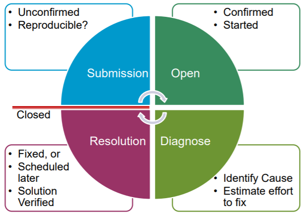

# Open Source Software Development <!-- omit in toc -->

These slides are a bit outdated, so I think it may be best to take everything with a pinch of salt.
- [Open Source Development](#open-source-development)
- [Free Software](#free-software)
- [Open Source and Free Software](#open-source-and-free-software)
    - [Case Studies](#case-studies)
        - [Linux](#linux)
        - [Vula/Sakai](#vulasakai)
- [Open Source Software](#open-source-software)
- [Interesting Facts](#interesting-facts)
- [Open Source and Business](#open-source-and-business)
- [Open Source Business Models](#open-source-business-models)
- [Open Source Development Culture](#open-source-development-culture)
- [Open Source Development Culture](#open-source-development-culture)
- [Open Source Issues](#open-source-issues)
- [Onion Model of OS Community Structure](#onion-model-of-os-community-structure)
- [Ways of running FOSS projects](#ways-of-running-foss-projects)
- [Before you start a FOSS project, first look](#before-you-start-a-foss-project-first-look)
- [What a FOSS Project needs](#what-a-foss-project-needs)
- [Making your Vision Public](#making-your-vision-public)
- [Features, Requirements and Status](#features-requirements-and-status)
- [Distribution](#distribution)
- [Version Control](#version-control)
- [Accurate Accounting of Deficiencies](#accurate-accounting-of-deficiencies)
- [Bug Tracking](#bug-tracking)
- [Issue Life Cycle](#issue-life-cycle)
- [Documentation Minimal Criteria](#documentation-minimal-criteria)
- [Licensing](#licensing)
- [Open Source Impact on Society](#open-source-impact-on-society)
- [Resources](#resources)
- [Catch Phrases](#catch-phrases)
# Open Source Development
* An approach to software in which the source code of a software system is published
    * Volunteers participate in the development process
    * Typically the original developer(s) remain custodians
* Differs from proprietary (closed) software, which is developed by a software company, and where the code is privately owned
* Term "open source" was coined in 1998 by a group of prominent software developers, including Eric Raymond, starting Open Source Initiative
* Preceded by "free software" movement, Free Software Foundation, who's main proponent is Richard Stallman
# Free Software
* From the GNU General Public License (GPL):
> When we speak of free software, we are referring to freedom, not price. Our General Public Licenses are designed to make sure that you have the freedom to distribute copies of free software (and charge for this service if you wish), that you receive source code or can get it if you want it, that you can change the software or use pieces of it in new free programs; and that you know you can do these things.
* Another term used to describe free software is *libre* highlighting the notion of freedom.
# Open Source and Free Software
* Open Source and Free Software essentially amount to the same thing
* Collectively it is referred to as FOSS or FLOSS 
    * Free (Libre) and Open Source Software
> Open Source is a development methodology; free software is a social movement
* Open Source Initiative attempted to market free software to make it more palatable based on solid pragmatic grounds, rather than ideological reasons
## Case Studies
### Linux
* Linux is an open source operating system, rivaling Microsoft Windows environment
* Created by Linus Torvalds in the early 1990s, while he was a student at the University of Helsinki
* In mid and late 1990s, it was used primarily by computer hobbyists/geeks
* Ported to run on a number of different platforms, from mainframes to PCs to handheld devices
* After much work by open source community, it has become mainstream
* Backed by major IT companies - IBM, HP
    * support ongoing development
* It is used increasingly by companies and governments
    * Less expensive alternative to the dominant Microsoft Windows Environment
    * No dependency on one company, e.g.: Microsoft, which produces proprietary (closed) software
### Vula/Sakai
* Vula at UCT is based on Sakai, a free and open source online collaboration and learning environment
* Sakai initially developed by a group of American universities - MIT, Stanford, etc
* Developed predominantly using Java platform
* Currently used by 100s of institutions around the world
# Open Source Software
* Operating Systems
    * Linux, FreeBSD
* Office Suites
    * Libre Office, KOffice
* Web Servers
    * Apache, Jetty
* Web Frameworks/APIs
    * Django, Bootstrap
* Databases
    * SQLite, MySQL, PostgreSQL
* Programming Languages
    * Python, PHP
* Misc
    * Blender
    * Gimp
# Interesting Facts
* Apache, which is open source, is the most popular web server in the world
* Much of the software used to run the internet, is open source
* Most popular alternative to Microsoft Office, **LibreOffice/OpenOffice**, is open source
* Mozilla Firefox and Google Chrome browsers are open source
* SQLite, file-based open source database, deployed with Android and Apple devices, Mozilla Firefox
* MySQL, open source database is used in critical applications by Google, Yahoo, NASA - I really don't know how accurate this is anymore. 
# Open Source and Business
* Software companies responds to Open Source differently:
    * Some use it extensively to build their business
        * Thawte - consulting of Mark Shuttleworth (??)
    * Some enthusiastically open source much of their software
        * Google with android
    * Some initially vehemently opposed Open Source, open source some of their software
        * Microsoft with VS code
    * Some have released free versions of their software to counteract influence of Open Source
        * Microsoft with Visual Studio
    * Some promote Open source offerings
        * IBM and HP promote Linux
    * Some have Open Source business models
        * MySQL
# Open Source Business Models
* Although open source software is freely distributed many companies are able to run viable businesses with it, e.g.:
    * Dual licensing, with free entry level version, and upgraded high level version having a cost
    * Service contracts featuring support and updates
    * Paid for training and learning materials
    * Developing customised extensions
* Open sourcing a product allows it to be developed
    * Quickly
    * Cheaply
    * Robustly
* Having this large user base allows your code to be scrutinized by multiple people
# Open Source Development Culture
* A community volunteers, so do need to get the culture and motivating forces right
> People should feel that their connection to a project, and influence over it, is directly proportional to their contributions
* A shared culture and etiquette for participation exists
* Be aware of the issues and politics
    * *Open Source* vs *Free Software*
* Build trust and social capital and slowly establish merit by offering solutions and for various issues
* Bossy, critical people won't be welcome
    * Everyone needs to feel welcome
# Open Source Development Culture
* FLOSS developers are proud of their achievements and continuously work to improve their software
    * Tend to treat their projects as their babies: very protective
* Essentially an exercise in Computer Supported Cooperative Work
    * Contributing are distributed and may never meet
# Open Source Issues
* Most free software projects fail: approximately 90-95%
* Structural issues
    * Unrealistic or vague specifications
    * Insufficient design
* Unrealistic expectations
    * Too few active developers
    * Open code has to be made comprehensible to strangers
    * Needs suitable tools, development web, communication tools
* Barriers to entry for new developers and new users
    * Poor presentation, documentation and packaging
* Challenges in project management
    * In-house management practices don't work
# Onion Model of OS Community Structure
* Core team has developer(s) who make decisions about software's direction, contributions to code base
* Committers have commit rights that allow admission to main code base
* Active developers regularly contribute to the code base
* Peripheral developers submit code as patches i.e. code does not enter code base until review from core team
* Active users contribute documentation, localization, support users in discussion forums, or file bug reports
* Passive users download and use the software without connecting to the community

# Ways of running FOSS projects
* Benevolent Dictators (BDFLs)
    * Linux and Linus Torvalds
    * Python and Guido van Rossum
    * Potential for forks means there are no true dictators
* Consensus-based Democracy
    * e.g.: apache
* Business-drive
    * e.g.: MySQL
# Before you start a FOSS project, first look
* Check whether someone else has done what you intend
* If they did, and open sourced their code, there is no reason to reinvent the wheel
    * There is no point not looking, and the payoff can beb huge
* Try internet search engines, or FOSS repositories
    * freshmeat.sourceforge.net (no longer updated)
    * www.sourceforge.net
    * directory.fsf.org - Free Software Foundation's directory
# What a FOSS Project needs
* Web Site
    * One-way information form the project out to the public
    * Interface for other project tools
* Mailing list
    * Usually most active communications forum in the project
    * "medium of record"
* Real-time chat
    * Quick, lightweight discussions; question/answer exchanges
* Version control
    * Enables developers to manage code changes conveniently
    * Enables everyone to watch what's happening to the code
* Bug tracking
    * Enables developers to keep track of what they're working on, coordinate with each other, and plan releases
# Making your Vision Public
* Choose a Good Name
    * Check against existing name & trademarks
* Register the domain (even if you use a canned host)
    * Canned hosting: site that offers free hosting and infrastructure for open source projects
        * web area
        * version control
        * bug tracker
        * download area
        * chat forums
        * regular backups
* Set up the website

# Features, Requirements and Status
* Features
    * Answers "What does it do?"
    * Brief list of the features the software supports
        * Put "planned" or "in progress" where that is so
* Requirements
    * Computing environment required to run the software
* Now people can decide if this software can work for them
    * And they can consider getting involved as developers
* Development Status
    * List the project's near-term goals and needs
        * e.g.: looking for developer with particular expertise
    * History of past releases, with features lists
        * Gives and idea of progress and speed
# Distribution
* Downloads
    * Source code in standard formats
    * Executables can come later
* The distribution mechanism should be as convenient, standard, and low-overhead as possible
* Important to standardize build and installation procedures
    * Otherwise you discourage developers who might otherwise have contribute to the code
# Version Control
* Allows you to safely store successive versions of your source code
    * Secure backup copy of the source code
    * Back-track to a stable version if things go horribly wrong
* Help to identify particular versions (or revisions) of your project, such as a particular product release
* Make it possible to create a new branch of your application source code, and work on this branch without compromising the stability of the original version
# Accurate Accounting of Deficiencies
* Documenting deficiencies out in the open, is the norm in the open source world
* Identify issues scrupulously and dispassionately in context
    * In the documentation
    * In the bug tracking database
    * On a mailing list discussion
* People will discover the deficiencies anyway
    * It's much better for them to be psychologically prepared that there are bugs
    * Shows a solid knowledge of how things are going
# Bug Tracking
* Bug Tracking software is useful to developers
* Signifies that a project should be taken seriously
    * Bugs are responded to promptly
    * Duplicate bugs are unified
* The higher the number of bugs in the database, the better the project looks!
    * Number of bugs recorded really depends on three things:
        1. Absolute number of bugs present in the software
        2. Number of users using the software
        3. Convenience with which those users can register new bugs
    1. Of these, 2 & 3 are more significant than 1
# Issue Life Cycle

# Documentation Minimal Criteria
* Tell the reader what expertise they need to have
* Describe clearly and thoroughly how to set up the software
* Give on tutorial-style example for every common task
* Label areas where the documentation is known to be incomplete
* Typically a real world user expects to install and use the software with no or minimal review of documentation
    * Searchable documentation should be available to users if they need it
* Align yourself with your users' point of view
* Availability of documentation
    * On the internet
    * Downloaded with the software

# Licensing
* Each Open Source project has a license associated with it
* License indicates user rights and responsibilities
* Most widely recognised license is the GNU General Public License (GPL), allows the user to:
    * Freely copy and distributed copies of source code and software, only with the license
    * Modify code, but those changes must be clear nad made available with same license
    * Doesn't allow code to be used in proprietary programs
* Other licenses like MIT license are more relaxed allowing code to be used in proprietary programs
* MIT - can use in closed environment

# Open Source Impact on Society
* Undermines the idea that work should be done for economic/financial gain
* Challenges traditional notions of copyright and intellectual property, which restricts others from modifying "creative" work
* Open Source software is used extensively in ICT for Development (ICT4D)
    * No or little cost, as compared to proprietary software
* Creative Commons licensing scheme for creative works inspired by Open Source
* Other areas of production also inspired by Open Source
    * Open Educational Resource, precursor to MOOCs
    * Open Source Hardware, stimulus to the Maker Movement
# Resources
* *Producing Open Source Software: How to Run a Successful Free Software Project* by Karl Fogel. O’Reilly. Licensed under the Creative Commons Attribution-ShareAlike License. producingoss.com/

See also:
* [FLOSS Vlog](twit.tv/shows/floss-weekly)
* [Free Software Foundation](www.fsf.org)
* [Open Source Initiative](www.opensource.org)
* [Open Source Repository](www.sourceforge.net)
* [Google Open Source](opensource.google.com)
* [Creative Commons](www.creativecommons.org)

# Catch Phrases
1. To many eyes all bugs are shallow
2. Cathedral and Bazaar
The Cathedral model, in which source code is available with each software release, but code developed between releases is restricted to an exclusive group of software developers.
The Bazaar model, in which the code is developed over the Internet in view of the public.
3. Release early. Release often. And listen to your customers.
4. Every good work of software starts by scratching a developer‘s personal itch.
5. When you lose interest in a program, your last duty to it is to hand it to a competent successor.
6. Treating your users as co-developers is your least-hassle route to rapid code improvement and effective debugging.
7. Smart data structures and dumb code works a lot better than the other way around.
8. If you treat your beta-testers as if they're your most valuable resource, they will respond by becoming your most valuable resource.
9. Provided the development coordinator has a communications medium at least as good as the Internet, and knows how to lead without coercion, many heads are inevitably better than one.