# CSC3003S Notes <!--omit in toc-->
- [CSC3003S Notes ](#csc3003s-notes)
- [Lectures](#lectures)
    - [Lecture 1](#lecture-1)
        - [Advanced Software Development](#advanced-software-development)
        - [The Process of Software Engineering](#the-process-of-software-engineering)
        - [Topics](#topics)
        - [Guest Lectures Thursdays](#guest-lectures-thursdays)
        - [What is version/source control?](#what-is-versionsource-control)
        - [source Control](#source-control)
        - [Web-based hosting service for version control using Git](#web-based-hosting-service-for-version-control-using-git)
    - [Lecture 2](#lecture-2)
        - [Advance Software Design: Project Management](#advance-software-design-project-management)
        - [No Silver Bullet](#no-silver-bullet)
        - [Project Management Tools](#project-management-tools)
        - [Scope of a Project](#scope-of-a-project)
        - [Defining Scope](#defining-scope)
        - [Determining Feasibility](#determining-feasibility)
        - [Project Planning Goals - Aka scope](#project-planning-goals---aka-scope)
        - [Project Planning Deliverables](#project-planning-deliverables)
        - [Project Planning Schedule](#project-planning-schedule)
        - [Project Planning Supporting Plans](#project-planning-supporting-plans)
        - [The Range of Management Activities](#the-range-of-management-activities)
        - [People](#people)
            - [Roles and Responsibilities](#roles-and-responsibilities)
                - [Essential Roles in Small Software development teams](#essential-roles-in-small-software-development-teams)
            - [Choosing People](#choosing-people)
            - [Managing with different Personality Types](#managing-with-different-personality-types)
            - [Management and Team Success](#management-and-team-success)
        - [Estimation and Metrics](#estimation-and-metrics)
            - [Milestones and Deliverables](#milestones-and-deliverables)
            - [Why Software Metrics?](#why-software-metrics)
            - [Software Metrics Characteristics](#software-metrics-characteristics)
            - [Are Software Metrics Worth Anything?](#are-software-metrics-worth-anything)
            - [Metrics for Object Oriented Development](#metrics-for-object-oriented-development)
        - [Scheduling](#scheduling)
            - [Project Scheduling](#project-scheduling)
            - [Critical Path or Network Analysis](#critical-path-or-network-analysis)
            - [What is Network Analysis?](#what-is-network-analysis)
            - [Terminology](#terminology)
            - [Network Analysis](#network-analysis)
    - [Lecture 4](#lecture-4)
        - [Gantt Charts](#gantt-charts)
        - [Risk](#risk)
            - [Managing Risks](#managing-risks)
            - [Boehm's Top Ten Risk Items +2](#boehms-top-ten-risk-items-2)
            - [Risk Matrix](#risk-matrix)
            - [3M's](#3ms)
        - [Questions](#questions)
        - [Conclusion](#conclusion)
            - [Planning vs. Management](#planning-vs-management)
            - [Tips on Project Control](#tips-on-project-control)
        - [Resources](#resources)
    - [Lecture 5](#lecture-5)
        - [Problems](#problems)
            - [Observations](#observations)
            - [Software Engineering Triangle](#software-engineering-triangle)
            - [Think Big, Act Small](#think-big-act-small)
            - [Wasted Effort](#wasted-effort)
            - [You Ain't Gonna Need It (YAGNI)](#you-aint-gonna-need-it-yagni)
            - [Economies of Adding Features](#economies-of-adding-features)
            - [The Crunch](#the-crunch)
            - [Software Entropy, Rot & Geriatrics](#software-entropy-rot--geriatrics)
            - [Yak Shaving](#yak-shaving)
            - [So we have](#so-we-have)
        - [Traditional SE Methods](#traditional-se-methods)
            - [Naive Approach](#naive-approach)
            - [Traditional Methods](#traditional-methods)
            - [Waterfall Method](#waterfall-method)
            - [Waterfall Concepts](#waterfall-concepts)
            - [Change and the Waterfall Method](#change-and-the-waterfall-method)
            - [Change and Feasibility](#change-and-feasibility)
        - [Modern Alternatives](#modern-alternatives)
            - [Alternative Ideas](#alternative-ideas)
                - [Prototyping](#prototyping)
                - [Rapid Application Development](#rapid-application-development)
        - [Iterative SE Methods](#iterative-se-methods)
            - [Iterative Process - The Big Difference](#iterative-process---the-big-difference)
            - [Examples of Iterative SE](#examples-of-iterative-se)
        - [Unified Process](#unified-process)
            - [Iterative Development and the Unified Process](#iterative-development-and-the-unified-process)
            - [Iterative Development](#iterative-development)
            - [Central Unified Process Ideas](#central-unified-process-ideas)
            - [Unified Process phases](#unified-process-phases)
            - [Artefacts](#artefacts)
        - [Comparison and Conclusion](#comparison-and-conclusion)
            - [Process Comparison](#process-comparison)
            - [Process Models](#process-models)
            - [Reduce Risk](#reduce-risk)
            - [Conclusion](#conclusion)
            - [Benefits of Iterative Development](#benefits-of-iterative-development)
    - [Lecture 6](#lecture-6)
    - [Lecture 7](#lecture-7)
        - [Principles of Agile Methods](#principles-of-agile-methods)
            - [What is Agile Software Development?](#what-is-agile-software-development)
            - [Principles of Agile Methods](#principles-of-agile-methods)
            - [Teams Must Be Empowered](#teams-must-be-empowered)
            - [Agile Manifesto](#agile-manifesto)
            - [Pareto's Law - 80/20 Rule](#paretos-law---8020-rule)
        - [Fixed Timescale](#fixed-timescale)
            - [Time Waits for No-one](#time-waits-for-no-one)
            - [Fixed Budget](#fixed-budget)
        - [Bare Requirements](#bare-requirements)
            - [Agile Requirements are Barely Sufficient](#agile-requirements-are-barely-sufficient)
            - [User Stories](#user-stories)
            - [Recording User Stories](#recording-user-stories)
            - [Agile Requirements are Barely Sufficient](#agile-requirements-are-barely-sufficient)
            - [Incremental Design](#incremental-design)
    - [Agile Development Cycle](#agile-development-cycle)
        - [How Frequent is Frequent enough?](#how-frequent-is-frequent-enough)
        - [Done Means Done](#done-means-done)
        - [Working Product at All Times](#working-product-at-all-times)
    - [Extreme Programming](#extreme-programming)
        - [Principles](#principles)
            - [System Metaphor in Extreme Programming](#system-metaphor-in-extreme-programming)
            - [XP Planning Game](#xp-planning-game)
                - [Stages](#stages)
                - [Release Planning](#release-planning)
                - [Iteration Planning](#iteration-planning)
                - [Iteration Steering](#iteration-steering)
            - [Pair programming in XP](#pair-programming-in-xp)
        - [Testing](#testing)
            - [Testing in Agile Development](#testing-in-agile-development)
        - [Testing in XP](#testing-in-xp)
            - [Test-first development](#test-first-development)
        - [Customer Involvement](#customer-involvement)
            - [XP Testing Difficulties](#xp-testing-difficulties)
            - [Test First Development](#test-first-development)
            - [Test Driven Development](#test-driven-development)
                - [The Rules](#the-rules)
                - [Unit Tests](#unit-tests)
                - [Conclusion](#conclusion)
        - [Refactoring](#refactoring)
            - [XP and Change](#xp-and-change)
            - [What is refactoring](#what-is-refactoring)
            - [Refactoring when Developing Software](#refactoring-when-developing-software)
            - [Examples of Refactoring](#examples-of-refactoring)
            - [Why Refactor](#why-refactor)
                - [Improves the Design of Software](#improves-the-design-of-software)
                - [Makes Software Easier to Understand](#makes-software-easier-to-understand)
                - [Helps find bugs](#helps-find-bugs)
                - [Helps you program faster](#helps-you-program-faster)
            - [Refactoring Categories](#refactoring-categories)
            - [Refactoring to Patterns](#refactoring-to-patterns)
        - [Conclusion](#conclusion)
            - [Collaboration with Users](#collaboration-with-users)
            - [Agile method applicability](#agile-method-applicability)
            - [Problems with agile methods](#problems-with-agile-methods)
            - [Agile methods and software maintenance](#agile-methods-and-software-maintenance)
            - [Plan-driven specification and development](#plan-driven-specification-and-development)
            - [Agile specification and development](#agile-specification-and-development)
            - [Architecture Change and Refactoring](#architecture-change-and-refactoring)
            - [Summary - Points to consider](#summary---points-to-consider)
                - [Principles of Agile Methods](#principles-of-agile-methods)
                - [Active User Involvement](#active-user-involvement)
                - [Fixed Timescale](#fixed-timescale)
                - [Agile Requirements are Barely Sufficient](#agile-requirements-are-barely-sufficient)
                - [Agile Development Cycle](#agile-development-cycle)
                    - [Frequent Delivery](#frequent-delivery)
                    - [Regular Release Cycle](#regular-release-cycle)
                - [eXtreme Programming (XP)](#extreme-programming-xp)
                - [TDD](#tdd)
    - [Lecture 8](#lecture-8)
        - [Introduction](#introduction)
            - [Waterfall v Scrum](#waterfall-v-scrum)
        - [Scrum Outline](#scrum-outline)
            - [Scrum Skeleton](#scrum-skeleton)
            - [Scrum Roles](#scrum-roles)
                - [Product Owner](#product-owner)
                - [Product Owner & Product Backlog](#product-owner--product-backlog)
                - [Scrum Team](#scrum-team)
                - [Scrum Master](#scrum-master)
        - [Scrum Flow](#scrum-flow)
            - [Scrum Rules](#scrum-rules)
                - [Sprints](#sprints)
        - [Scrum Meetings](#scrum-meetings)
            - [Sprint Planning](#sprint-planning)
                - [Time Boxed](#time-boxed)
            - [Daily Scrum](#daily-scrum)
                - [Meeting](#meeting)
                - [Time Boxed](#time-boxed)
                - [Sprint](#sprint)
                - [Backlog](#backlog)
                - [Non-viable](#non-viable)
                - [Review Meeting](#review-meeting)
            - [Sprint Review](#sprint-review)
                - [Meeting](#meeting)
                - [Retrospective](#retrospective)
        - [Process Artefacts](#process-artefacts)
            - [Process Overview](#process-overview)
            - [Scrum's Artefacts](#scrums-artefacts)
            - [Product Backlog](#product-backlog)
            - [Sprint Backlog](#sprint-backlog)
# Lectures
## Lecture 1
### Advanced Software Development
JonJon Clark - clrjon005@myuct.ac.za

**Topics**
* Requirements Gathering
* Software Design
* Documentation
* Coding
* Testing
* Bug Fixing
### The Process of Software Engineering
**Definition**
* The establishment and use of effective engineering principles in order to obtain software that is reliable and works efficiently on real machines.
* The application of a sytematic, disciplined, quanitifiable approach to the development, operation, and maintenance of software.
### Topics
1. Review O-O & UML
2. Project Management
3. Software Development Methodologies
4. Agile Software Development
5. Software Development with SCRUM
6. Case Study: SCRUM in Game Development
7. UML, Patterns and Architecture
8. Software Architecture
9. Design Patterns
10. Open Source
11. Validation/Verification
### Guest Lectures Thursdays
### What is version/source control?
* Version control systems are a category of software tools that
help a software team manage changes to source code over
time.
* keeps track of every modification to the code in a special kind
of database
* If a mistake is made, developers can turn back the clock and
compare earlier versions of the code to help fix the mistake
while minimizing disruption to all team members
### source Control
Managing a codebase with lots of simultaneous contributors
| Distributed                                  | Centralized                                           |
| -------------------------------------------- | ----------------------------------------------------- |
| Mercurial (hg),git                           | CVS, Subversion                                       |
| Work in local repository, sync changes later | Repository exists on a client server, work on clients |
### Web-based hosting service for version control using Git
* Bitbucket
* Github
* [Gitlab](gitlabcs.uct.ac.za)
## Lecture 2
### Advance Software Design: Project Management
* Concerned with activities involved in ensuring software is delivered on time and on schedule and in accordance with the requirements of the organisations developing and procuring the software.
* Project management is needed because software development is always subject to the **budget and schedule constraints** that are set by the organisation.
* Read [Bennet Chapter 22](/docs/BennetChapter22.pdf)
* Systems Development is a complex activity that requires careful project management
* Inter-dependencies between the artefacts of softwaree development
    * production has to be planned, monitored and co-ordinated
    * So that software development is efficient, effective and on time.
    * E.g.: when would you start build the Chess AI?
* A software development project may involve many developers, some with specialized skills who will be required at different times.
* Activites must follow a particular sequence.
    * For example,  testing a system can only begin when at last some elements have been constructed.
    * Test scripts and test harness may be prepared earlier in the project
### No Silver Bullet
There is no technique that fixes the inherent complexity of software design and development.
### Project Management Tools
* Basecamp
* Freedcamp
* TeamGantt
* Asana
* Overleaf
### Scope of a Project
* The functions and features that are to be delivered to end-users
* The data that are input and output
* The content that is presented to users as a consequence of using the software
* The performance, constraints, interfaces and reliability that bound the system
### Defining Scope
* Scope is defined using one of two techniques
    * A narrative description of software scope is developed after communication with stakeholders
    * A set of use-cases is developed. A use-case is a scenario-based description of the user's interaction with the software from the user's point of view.
* Performance considerations encompass processing and response time requirements.
* Constraints identify limits placed on the software by external hardware, available memory, or other existing systems.
### Determining Feasibility
* Given the scope, determine the resources required.
    * Cost
* Make sure you have an answer to the question:
    * Do we have the resources we need to build this software?
* Resources are:
    * People
    * hardware and software tools
    * reusable components.
### Project Planning Goals - Aka scope
* Goals are derived from the needs and expectations of stakeholders:
    * Project sponsor
    * customer for deliverables
    * Users of the project outputs
    * project manager and project team
* Find true needs that create real benefits
    * Prioritize them
* Create measurable goals
    * S - Specific, significant, stretching
    * M - Measurable, meaningful, motivational
    * A - Agreed upon, attainable, achievable, acceptable, action-oriented
    * R - Realistic, relevant, reasonable, rewarding, results-oriented
    * T - time-boxed, time-based, time-bound-timely, tangible, trackable.
### Project Planning Deliverables
* Deliverables are a list of items that have to be delivered to meet the goals
    * Verifiable and specific
    * Can be report, equipment acquisition or Executable code module etc
    * Has a stakeholder who needs it
* Say when it has to be delivered
* Give quality standards
    * document is according to specified format
### Project Planning Schedule
* The effort required (in terms of time)
* The people required (and other resources)
* Update deliverables with this & work schedule out
* If the schedule is unrealistic you can justify some of the following:
    * Renegotiate deadline - delay
    * Additional resources - more expensive
    * reduce scope - fewer deliverables (only thing that makes sense for capstone - carefully determine your scope)
### Project Planning Supporting Plans
Human Resource Plan
* Name key individuals and orgs: describe rols and responsibilities
* Describe the number and type of people needed
    * Start dates etc

Communication and Management Plan
* Who needs to be kept informed about the project
* How they will receive the information?
    * Weekly review meeting
    * progress reports
    * revised schedule
  
Risk Management Plan
* Identify as many risks as possible
* Be prepared if something bad happens

Marketing Plan
* Important to get funding

### The Range of Management Activities
**P**eople
* Managers, Project Managers, Team Leaders, Software Team, Customers, End-Users
**P**roduct 
* Scope and decomposition
**P**rocess
* SDLC: initiation -> Analysis -> Design -> Construct -> Test -> Implement 
* UP: Inception -> Elaboration -> Construction -> Transition -> Production
**P**roject
* Size estimation, scheduling, risk management, tracking

### People
#### Roles and Responsibilities
It seems obvious that a team needs people with different skills
* Range of duties in a small project
    * Project management: Strategist, Leader, Politician, Project Facilitator, Administrator
    * Systems analysis: Stakeholder needs, Interaction Designer, Cost estimator
* User interface designer, user stories
* Architect: Application overview, performance
    * Middleware —software layer between the operating system and the applications on a distributed computer network
* Specialists as required: database, games engine, mobile development, …
* Documentation: Amanuensis

##### Essential Roles in Small Software development teams
1. Course developer - prep and coordination of training.
2. Database designer - essential to the process, mainly due to the specific nature of its knowledge
3. Implementer - programs sub-systems and components that support
4. Integrator (lead programmer) - responsible for maintaining the implementer' awareness of the project context, for identifying the tasks to be undertaken and for appointing th eperson responsible for each one. Also responsible for the initial definition of the critical dates of the project and for developing a plan for the integration of the sub-systems, to allow the project manager to inform th eclient when each feature is expected to be available.
5. Process Engineer - mainly concerned with the management of the dev process, its adaptation to org context and monitoring its implementation, in order to identify and implement process improvements.
6. Project Manager - Assume a global overview of the project through a detailed interaction with the internal and external participants. Must create the conditions for the project to achieve success, by ensuring timeliness and fulfilment of all commitments. Requires: basic knowledge in management; knowledge about the client’s business domain; project management methodologies and negotiation skills.
7. Project reviewer -  This role cannot be considered critical, however, due toresponsibilities related to the verification and approval of several artefacts produced by other participants, and possible conflict of interests, this person cannot have another role within the project
8. Software Architect -  Responsible for setting the technological foundation onwhich the project implementation should be based. The software architect is responsible for managing the technical risks.
9. Systems Administrator -  Focused on ensuring the provision of the infrastructure needs (e.g., PCs for developers, servers, etc.)
10. Systems Analyst - Scope management. Identify and document the requirements (functional or non-functional). Understand the client'sbusiness domain and to perceive the real motivations and relevance of the requirements.
11. System tester - Entrusted with very different tasks, like review of documentation and testing behaviour. 
12. Test Manager - Responsibility is to ensure the product quality by devising a plan for internal quality audits and implementation. Cannot have other roles, particularly with those roles related to the design and construction.
13. UI designer - The scope of this role in a project varies according to the nature of the artefacts to be developed.
#### Choosing People
* Information from candidates about their background and experience
    * Best evidence to judge suitability
#### Managing with different Personality Types
* Backgrounds and personality styles of team members
* Management styles of customers and developers
* Realize tha other people are not like you
#### Management and Team Success
* Most software engineering is a group activity
    * Non-trivial software projects cannot be done by one person
    * People motivated by success of the group and their own personal goals
* Individual success depends on:
    * Ability and interest to work hard
### Estimation and Metrics
#### Milestones and Deliverables
* Activity - Task that takes time
    * Duration - length of time needed for an activity
    * Due date - date for completion of the activity
    * Precursor - activity which precedes others that depends on it
* Milestone
    * Completion of an activity
    * Recognisable end-product of a task
        * Hand over system for testing
    * Requires a formal, measurable output
* Deliverable
    * A project result that is delivered to customer
* Milestone vs Deliverable
    * Deliverable is a measurable and tangible outcome of the project. They are developed by project team members in alignment with the goals of the project.
    * Milestones on the other hand are checkpoints throughout the life of the project. They identify when on or multiple groups of activities have been completed thus implying that a notable point has been reached in the project.
#### Why Software Metrics?
* To plan and manage a software development project
    * Need to estimate the resources required for each of its constituent activities
        * Subjective perceptions of the activity
        * Based upon measurements of size and complexity
            * Activity itself
            * Artefact that is produced
    * Software metric measures some aspect of software development
        * Project level - cost or duration
        * application level - size or complexity
#### Software Metrics Characteristics
* Process Metrics
    * Process metrics measure some aspect of the development process
        * Project cost to date
        * amount of time spent so far on the project
        * (These change all the time)
* Product Metrics
    * Product metrics measure some aspect of the software product.
        * Analysis model
            * number of classes in an analysis class diagram
        * test plans
        * program code
* Result Metrics
    * Measure outcomes
        * Current cost of a project 
    * Also known as control metrics
        * used to determine how management control should be exercised
            * Measurement of the current level of progress in the project is used to decide whether action is necessary to bring the project back onto schedule.
* Predictor Metrics
    * Quantify estimates for project resource requirements
        * Class size
            * A crude measure might be a simple count of attributes and operations.
            * Predictor because it can be used to predict the time that it will take to produce code.
    * Also measure of some aspect of a software product that is used to predict another aspect of the product or project progress.
        * Predict that the system will be difficult to maintain
        * Predict very low levels of reuse
        * Change the design to improve the system
#### Are Software Metrics Worth Anything?
* Useful for prediction and resource estimation
    * Otherwise use of software metrics is rather limited
* Validity of predictor metrics is based on 3 assumptions
    * You can measure something useful
    * That measure actually predicts something worthwhile
    * The relationship is real and can be expressed in a model or a formula.
* Size metrics can be used to estimate the resource requirement for a project provided that appropriate historical data is available to derive and validate the relationship.
#### Metrics for Object Oriented Development
* Ability of a package to absorb change is partly dependent on ratio of abstract classes to all classes.
    * 0 - has concrete classes and is difficult to change
    * 1 - has no concrete classes at all (easy to change)
* Application size
    * Number of use cases
    * Number of domain classes
* Class size
    * Number of attributes
    * Number of operations
    * size of operations
### Scheduling
#### Project Scheduling
* Split the work in a project into seprate tasks
    * Minimize tasks dependencies where one tasks wait for another to complete
* Estimate the calendar time needed to complete each task
    * Split up if much longer than 1 week
    * Make tasks concurrent to make optimal use of workforce
* Estimate the effort required
    * Who will work on the tasks
    * Resources needed to complete each task
* Mostly needs project manager's intuition and experience. 

#### Critical Path or Network Analysis
* Related to PERT Charts
* Minimum overall duration of the project according to the estimates depends on the critical path(s)
* Any delay of a task on the critical path delays the whole project.
#### What is Network Analysis?
* Project Tasks
    * Often interdependent
    * But need to be done in parallel for teamwork to be effective
* Task networks are graphical depictions of task dependence
* Network analysis is a project planning method that
    * Determines the critical path
    * Establishes "most likely' time estimates
    * Calculates boundaries to stop project slippage.
#### Terminology
* Earliest Start/Finish
    * Earliest a task can begin/end if all preceeding tasks are completed in the shortest time
* Latest Start/Finish
    * Latest a task can begin/end without delaying the minimum project completion time
* Critical Path
    * Chain that determines overall project duration
    * Can be multiple critical paths (not just one)
* Slack (Float)
* The amount of surplus time or leeway allowed while still maintaining the critical path

#### Network Analysis
Tasks are shown as boxes
sequences constraints are lines connecting the boxes

The following steps are better illustrated in the [this](docs/networkanalysis.pdf) document.
* Step 1
    * Label Tasks in order and indicate dependencies.
* Step 2
    * From the estimated time for each activity
    * Carry out a "forward pass"
    * Fill in Earliest Start, Earliest Finish
* Step 3
    * Carry out "backward pass"
    * Fill in latest start, latest finish
* Step 4
    * Fill in total float
        * Time by which an activity may be delayed without affecting the final completion date
* Step 5
    * Fill in Free Float
        * Amount of time an activity can expand without affecting the start or finish of any other activity
    * FF = ES (next) - EF (current)
* Critical Path
    * This path is the manager's primary concern

Here is an example:

TO DO
* Finish Example
## Lecture 4
### Gantt Charts
* Horizontal Bar Chats
    * Horizontal axis represents project time span
    * vertical axis represents project tasks
* Capture
    * Task completion
    * Simple dependencies
    * Milestones and Deliverables
* Can't handle complex task dependencies
* Supported by automated scheduling tools
    * Microsoft project 
* Possible options:
    * Teamgantt
    * Microsoft project
* Visualize entire project

Before Project

### Risk
#### Managing Risks
* Why?
    * Projects have a high level of uncertainty
    * Better to anticipate problems in advance
* How?
    * Identify specific risks to the project
    * Analyze the risks
    * Rank them in a particular order
    * Plan for monitoring, mitigation, management
    * Revisit continually during project
#### Boehm's Top Ten Risk Items +2
* Being blindsided by the competition
* Outside interruptions
  1. Personnel shortfalls - failure to recruit or retain key staff
  2. unrealistic schedules and budgets
  3. Developing the wrong functions
  4. Developing the wrong user interfaces
  5. Gold-plating
  6. Continuing stream of requirements changes
  7. Shortfalls in externally-performed tasks
  8. Shortfalls in externally-furnished components
  9. Real-time performance shortfalls
  10. Straining computer science capabilities
#### Risk Matrix
* Sort risk by a combination of:
    * Probability (high, medium, low)
    * Impact - catastrophic (project failure), critical (massive delay), marginal, negligible

#### 3M's
* Mitigation
    * How can we void or reduce the risk?
        * Avoid the riskL change requirements
        * Transferring the risk: e.g.: buy insurance
    * Or assume the risk and accept and control it
* Monitoring
    * What factors can we track that will enable us to determine if the risk is becoming more or less likely?
* Management
* What contingency plans do we have if the risk becomes a reality

[Example of risk](docs/examplesofrisks.pdf)

### Questions
1. Which of the following statements best describes how one goes about identifying the critical path:
    * a) Find those milestones where the earliest start time is equal to the latest start time <--- Answer
    * b) Find those milestones where the earliest start time is less than the latest start time
    * c) Find those milestones where the earliest start time is greater than the latest start time
    * d) Find those milestones with some scheduling flexibility
    * e) None of the above
2. What does the term GANTT stand for
    * nothing
3. Which of the following statements best explains what is meant by slack time in Critical Path Analysis?
### Conclusion
#### Planning vs. Management
* Planning
    * Pre and Post
    * Network analysis, resourcing, risks, schedule
* Management
    * During
    * Controlling resources and timescales

#### Tips on Project Control
* Remember to update planning documents
    * Show progress in Gantt chart
    * Reassess risks
### Resources
* Bennett, McRobb & Farmer, Object-Oriented Systems Analysis and Design: Using UML, McGraw-Hill. Chapter 22: Managing Object-Oriented Projects.
    * Available [here](highered.mcgrawhill.com/sites/0077125363/student_view0/online_chapters.html)
* Sommerville, Software Engineering, Pearson
    * Chapter 22: Project management: Risk management, Managing people, Teamwork 
    * Chapter 23: Project planning, Software pricing, Plan-driven development, Project scheduling, Agile planning, Estimation techniques

## Lecture 5
Software Engineering Methods
### Problems
#### Observations
* Most common problem in software systems is not the construction, but the estimation.
* Software projects fail to meet cost and schedule, because those targets are wrong.
    * Costing software is difficult
* Know little about accurate estimations so targets are unreasonable
    * Made by people least able to make them
        * e.g.: marketers, managers and customers.
* Communication is hard when ideas are abstract or conceptual

#### Software Engineering Triangle
* Time
* Scope
* Cost

#### Think Big, Act Small
Just say no (to large projects)
* Secret to project success: enforce limits on size and complexity
    * Size and complexity trump all other success factors
* Break large projects down into a sequence of smaller ones, prioritized on direct business value.
    * Use stable, full-time, cross-functional teams that follow a disciplined agile approach.
* Quick solution is to just say no to large projects.
    * More sensibly: adopt a small project strategy.
        * Deliver software at lower cost and with fewer defects.
* Projects too often get too big to succeed.
    * Constantly being called on to do more for less
    * But the real key to success is doing less for less
        * Splitting large projects into a sequence of small ones.
#### Wasted Effort
More than 45% of features are never used, while another 19% are used rarely
* Almost 2/3 of the features are never or rarely used
* Stop Developing these features and double productivity
#### You Ain't Gonna Need It (YAGNI)
* Cry to prevent speculative development and Gold Plating (aka Bells and Whistles)
> I am sure Im going to need some additional functionality later, so ill write it now
* Better is to build only what you need now
* Speculative development adds complexity to code prematurely
#### Economies of Adding Features
Profitable Project: Returns outpace costs

Ultimately Unprofitable project: features become a drag

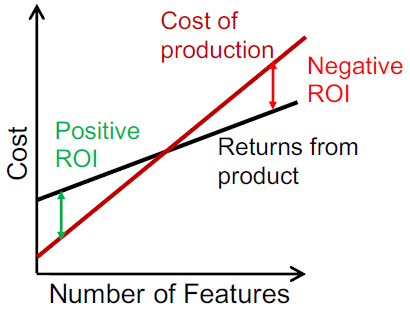

However, **The cost curve under most software processes is exponential**
* Fred Brooks attributes the exponential rise in costs to the cost of communication
    * Customer and developer must understand each other perfectly.
* New Projects have success because the cost curve is still flat
* Cost start increasing
    * Quickly overcome any additional value added from new features.

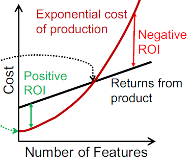

#### The Crunch
* Crunch is the side effect of other problems and the cause of burnout.

#### Software Entropy, Rot & Geriatrics
* Entropy is a measure of disorder in a physical system
* Software entropy: measure of code complexity
    * Tends to increase over time
    * Speculative development adds complexity at the start
    * Bug fixes and enhancement increase complexity and degrade structure
        * Most software applications grow at annual rates of 5% - 10%.
* Entropy makes it hard to 
    * Make changes and fixes
    * Understand the code
* Cure for entropy is
    * YAGNI at the start and
    * Refactoring as you go along
#### Yak Shaving
Official jargon for computer science
1. You want to generate documentation based on your git logs
2. You try to add a git hook only to discover the library you have is incompatible and therefore won't work with your web server
3. You start to update your web server, but realize that the version you need isn't supported by the patch level of your OS, so you start to update your OS
4. The operating system upgrade has a known issue with the disk array the machine uses for backups.
5. etc...

Compromise if necessary
Explore alternate yaks

#### So we have
* Undefined system
* Fixed resources
* Fixed time
* high quality

*Goal* deliver software product to meet the clients needs on time and within budget

Can we develop quality software under these circumstances?

### Traditional SE Methods
#### Naive Approach
* Naive , first approach
    * Actually lack of a methodolgy
* Little (zero) planning, dive straight into implementation
* Reactive
* End with bugs
    * If bugs multiply too fast to fix: "death spiral" -> cancelled
    * To make it you have to crunch

#### Traditional Methods
* Used for well defined systems
    * User can specify the requirements
    * Developers can then do the development
    * System is finished
    * System is launched

#### Waterfall Method
Analysis -> Requirement specification -> Design -> Implementation -> Testing and Integration -> Operation and Maintenance

* Linear, sequential
* Teams gather requirements
* Develop the product
* Test it to see if they implemented the specification correctly.
* After release they gain insight into what the customer actually desired.

Version 2
* The target has changed
* Not all is lost
* Given more money you can try again
* There is a good chance the team learned quite a bit about what their customers actually desired.
    * Next rocket has a better chance of landing closer to the actual customer needs

#### Waterfall Concepts
* Software as an Engineering discipline
> Do it right the first time
* The more design time reduces risk
    * By planning upfront you identify problems early and avoid mistakes
    * The longer analyse a system, the more edge cases you'll discover
        * Often design elaborate systems for problems that do not really exist
#### Change and the Waterfall Method
* The cost of change increases exponentially with time
    * Conservative design decisions motivates by fear of change
    * A change late in the process costs 1000 times as much as a change early into the process
        * Five minutes to write a spec
        * Two days to program the feature
        * Two weeks to test it before deployment
        * Month to write a patch that fixes a problem after deployment

#### Change and Feasibility
Is it feasible first to define the whole problem, then design the entire solution, then build the software, and then test the product?

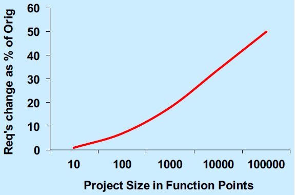

### Modern Alternatives
* More lightweight than waterfall
    * Less documentation
    * Fewer procedures
* Don't release only one version at the end
    * Parallel development
    * Produce of prototypes
* Only do what is required
    * No adding in extra requirements
* Design for change
    * Change is inevitable ensure you can handle it

#### Alternative Ideas
##### Prototyping
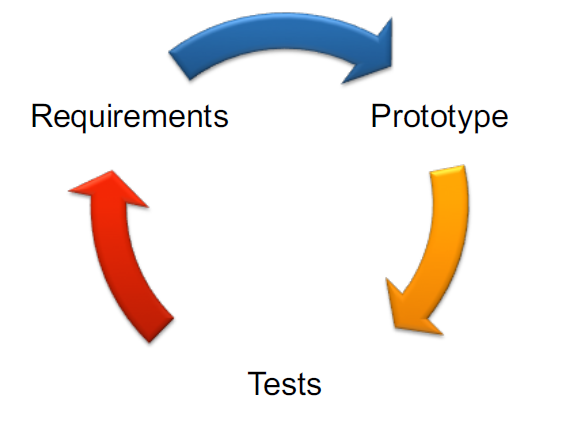

##### Rapid Application Development
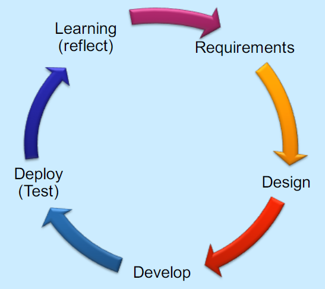

### Iterative SE Methods
* Plan development
* Undertake development
* Generate prototype
* Get user feedback
* Develop again

*Iterative software development* a process that reaches the goal in a series of ever improving delivery cycles

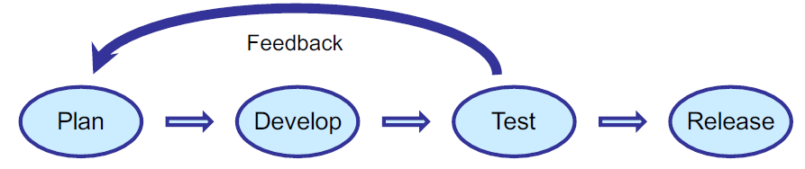

#### Iterative Process - The Big Difference
* Instead 2 to 18 months to create and evaluate a concept
* Build and show a new version to users every 2 to 4 weeks
* Requires
    * Team members close together and close to customer
    * Team members agree on good ideas over a  period of hours, not months.
    * Team become experts through intense hands-on problem solving and testing
* Ends up with real systems meeting the user's needs, not their "perceived" needs
* Favoured by small start up companies
    * Greatly reduce the risk of a project failing
        * Only one shot at the target, steer your way to success using information instead of launching blindly into the unknown.
* Long term, iterative development delivers more value sooner, with lower overall risk
* Project is intensely focused
    * In completing only high priority features, many alternative concepts never get explored.
        * Good ideas can be lost
#### Examples of Iterative SE
* Agile Software Development ("Agile Manifesto")
    * Mini software projects; face-to-face communication
* Rapid Application Development (RAD - James Martin)
    * Voice of customer; rigid schedule
* Extreme Programming (XP - Kent Beck)
    * Design on the fly; unit testing of all code, pair programming; refactoring
* Scrum (Takeuchi, Nonaka and, later, Schwaber)
    * Facilitated teams scrum down in short iterations (sprints); empirical process

### Unified Process
#### Iterative Development and the Unified Process
* (Rational) Unified Process (RUP or UP) is a process for building high quality object-oriented systems
* Central idea: Iterative Development
    * The life of a system stretches over a series of cycles, each resulting in a product release
#### Iterative Development
* Development as a series of short mini-projects: iterations
* Each iteration gives a tested, integrated & executable system
* An iteration forms a short (2-6 weeks) complete development cycle:
    * Requirements
    * Analysis
    * Design
    * Implementation
    * Integration and System Test
* Iterative lifecycle is based on the successive enlargement and refinement of a system
    * Multiple iterations with feedback and adaptation
* System grows incrementally over time, iteration by iteration
    * May not be eligible for production deployment until after many iterations
* Output of an iteration is not an experimental prototype but a production subset of the final system.
* Each iteration tackles new requirements and incrementally extends the system
* An iteration may occasionally revisit existing software and improve it

#### Central Unified Process Ideas
* Iterative Development is number one!
* Others
    * Tackle high risk items early
    * Continuous engagement of users
    * Core architecture built in early iterations
    * Continuous verification of quality: test
    * Apply use cases continuously
    * Model Software with UML
    * Carefully manage requirements
    * Control changes

#### Unified Process phases
* Inception - Define the scope of project
    * Feasibility
* Elaboration - Plan project, specify features, baseline architecture
* Construction - build the product
    * Refine vision, implement core, resolution of high risks, identify major requirements
    * Several iterations (3 in book)
* Transition - Transfer the product into end user community
    * Deployment, Release
    * 
> IECT
More notes on [Iterative Development and Unified Process](docs/IterativeDevelopmentAndTheUnifiedProcess.pdf). 

#### Artefacts
* Docs, diagrams, code, etc. That track our progress
* Everything is optional
* Best kept electronically on website
* Following can start in inception
    * Use-case model, vision, supplementary specification, glossary, s/w development plan, development case

### Comparison and Conclusion
#### Process Comparison
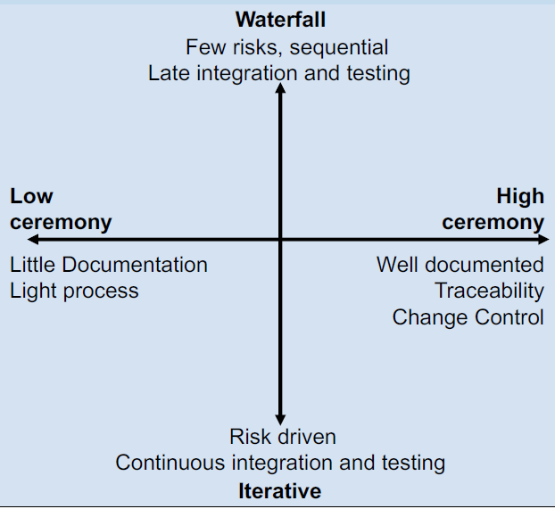

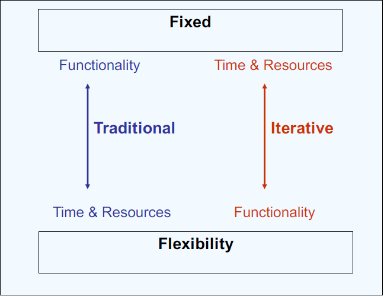

Fixed functionality, but flexible time and resources for Traditional

Flexible functionality, but fixed time and resources for Iterative
#### Process Models
* A framework of tasks applied during software engineering:
    * Linear (Waterfall) - based on conventional engineering
    * Prototyping: Build a system to clarify requirements
    * Rapid Application Development (RAD) - well defined 60-90 day projects
    * Incremental : deliver increasing functionality at each iteration
    * Spiral (Boehm): Similar set of tasks applied for each turn of the spiral
    * Component based: aimed at producing and reusing O-O components
    * Agile: Embrace change and adapt to it and keep things simple

#### Reduce Risk
* Iterative methods attempt to reduce risk by bringing versions out early
* For further discussion go [here](http://www.projectsmart.co.uk/reducing-risk-increasing-probability-of-project-success.php)

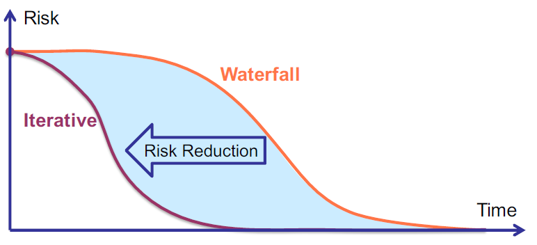

#### Conclusion
* Consider only iterative technologies
* Agile technologies
    * Small time cycles
    * Many prototypes
    * Meet user requirements
    * Timescale is adopted by the development team

Alternative to the SE Constraint Triangle?

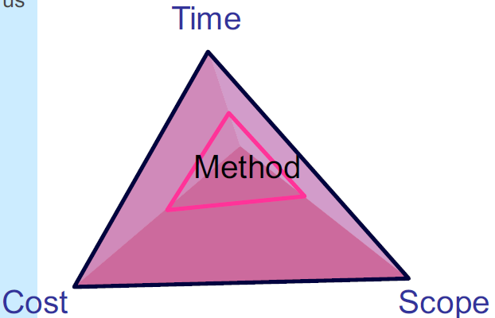

#### Benefits of Iterative Development
* Early reduction of risk: technical, requirements, objectives, usability, etc
* Early visible progress
* Early feedback
    * User engagement, and adaptation
    * Better meets the real needs
* Managed Complexity: no very long and complex steps
* Get a robust architecture
    * Architecture can be assessed and improved early
* Handle evolving requirements
    * Users provide feedback to operational systems
    * responding to feedback is an incremental change
* Allow for changes: system can adapt to problems
* Learn and apply lessons within the development process
## Lecture 6
Agile is a set of values and principles.

[Agile Manifesto](docs/Agile-Manifesto.pdf)

## Lecture 7
### Principles of Agile Methods
#### What is Agile Software Development?
* Put the software being developed first
* Acknowledge that user requirements change
* It is agile because it can respond quickly to the users changing needs
* Advocates frequent and regular, software released
    * Users can respond quickly to these releases, changing requirements
> Thats not what we meant!
Agile Development Methodologies
#### Principles of Agile Methods
| Principle            | Description                                                                                                                                                                           |
| -------------------- | ------------------------------------------------------------------------------------------------------------------------------------------------------------------------------------- |
| Customer Involvement | Customers should be closely involved throughout the development process. Their role is to provide and prioritize new system requirements and to evaluate the iterations of the system |
| Incremental Delivery | The software is developed in increments with the customer specifying the requirements to be included in each increment.                                                               |
| People not process   | The skills of the development team should be recognized and exploited. Team members should be left to develop their own ways of working without prescriptive processes.               |
| Embrace Change       | Expect the system requirements to change and so design the system to accommodate these changes                                                                                        |
| Maintain Simplicity  | Focus on simplicity in both the software being developed and in the development process. Wherever possible, actively work to eliminate complexity from the system.                    |
#### Teams Must Be Empowered
* The project team must have sole responsibility to deliver the product
* ANy interference with the project team is disruptive and reduces their motivation to deliver
* The team must together
    * Establish and clarify the requirements
    * Prioritise them together
    * Agree to the tasks required to deliver them
    * estimate the effort involved
* It ensures the buy-in and commitment from the entire project team from the outset
* When challenges arise, the team feels a real sense of ownership
#### Agile Manifesto
We are uncovering better ways of developing software by doing it and helping others do it.
Through this work we have come to value:
* Individuals and interactions over processes and tools
* Working software over comprehensive documentation
* Customer collaboration over contract negotiation
* Responding to change over following a plan

That is, while there is value in the items on the right, we
value the items on the left more. 

> If you can dodge a wrench you can dodge a requirement
#### Pareto's Law - 80/20 Rule
* Typically 80% of your results may actually come from only 20% of your efforts!
    * Try to apply the 80/20 rule, and focus on the important 20% of effort that gets the majority of the results.
* The difficult question is can you see initially which 20% is the important 20%?
    * The 20% that will deliver 80% of the results
    * In very many cases, the answer is NO

### Fixed Timescale
#### Time Waits for No-one
* In Agile Development, requirements evolve, but timescales are fixed
* Contrast to traditional development
    * Capture all known requirements
    * Changes are subject to change control
    * Users are told it's much more expensive to change or add requirements during or after the software is built
        * It becomes imperative to include everything they can think of, everything they ever dreamed of
* Normally
    * Users may actually use only 20% or less of the product
    * Many projects start with a bloated scope
        * No-one is sure at the outset which 20% they will use
    * It is impossible to think of everything, things change, and things are understood differently.
* Agile development assumes that requirements emerge and evolve
    * However much analysis and design you do, you cannot really know what you want until you see and use the software
    * In the time spent analysing and reviewing requirements and designing a solution, external conditions could change
#### Fixed Budget
* What does business expect from development teams?
    * Deliver and agreed business requirements
    * On time and within budget
    * To an acceptable quality
        * In agile development, it is the scope that is variable, not the cost and timescale
* For this to work, it's imperative to start development with the core, highest priority features
    * Delivered in the earliest iterations
* As a result
    * Business has a fixed budget
    * Based on affordable resources and
    * Can make plans based on a certain launch date
### Bare Requirements
#### Agile Requirements are Barely Sufficient
* Capture requirements at a high level and on a piecemeal basis
    * Just in time for reach feature to be developed
    * Barely sufficient
        * The minimum to enable development and testing
            * Minimise the time spent on anything not part of product
* Understand enough to determine the scope and for high level budgetary estimates
* Captured in collaborative workshops so that all team members understand the requirements
    * Allows everyone to contribute, challenge and understand what's needed and why
#### User Stories
* Most agile teams represent each requirement as a user story
    * Similar to Use Cases but lightweight and simpler
    * A simple statement about what a user wants to do with a feature
* Should focus on the who, what and why of a feature, **now how**
    * on a job site, two high-level User Stories might be:
        * As a job seeker, I want to search for a job, so I can advance my career
        * As a recruiter, I want to post a job vacancy, so I can find a new team member
* The general form can be
    * As a [user role], I want to [goal], so I can [reason]
* At the start of a project, capture an initial list of User Stories up-front
    * useful for estimating and planning
* Defer capturing the details until the story is prioritised and due to be developed
* Users often tell stories
    * About the failings of their current system
    * How they see things working better in future
    * Capture these stories as User Stories, as they are told
* In traditional development projects, these stories are captured in a lengthy analysis process and available in a lengthy document
    * Not user friendly
#### Recording User Stories
* Written on postcard size cards in 3 parts
    * Heading
        * Name/description of the user story, reference numbers, estimated size, etc
    * Conversation (on the front of the card)
        * Information about the user story + what system is meant to do
            * A sketch or diagram of the feature
            * Notes about how it should function
    * Confirmation (on the back of the card)
        * Test cases to help identify scenarios that users, developer and/pr analysts may not have thought of
* Writing User Stories on a card ensures requirements are broken into small manageable pieces of functionality

#### Agile Requirements are Barely Sufficient
* Cards can be supported by documentation, but keep it to the bare minimum to allow a feature to be developed, and always in very small units.
* Requirements should be broken into tasks of no more than 16 hours or preferably 8 hours, so progress can be measured daily
* All items are deliverables not activities or tasks
    * You can see a deliverable to judge it quality and completeness
    * A task you cannot
#### Incremental Design
* As opposed to Fred Brooks *No Silver Bullet* Agile does not follow a top-down design method.
    * Top-down design says: time in design is worth it to save cos of re-working the design many times.
* Agile design is always the same size as the system.
    * "You can't possibly anticipate the problems and alternatives that will arise once you start coding"
* If a new feature comes along that requires major changes then that is the trade-off for the flexibility it allows.
    * perhaps this feature wa not even known at the beginning anyway!
    * Or it might have gone away if we knew of it at the start!

## Agile Development Cycle
* The cycle is Analyse, Develop, Test; Analyse Develop, Test
    * Doing each step for each feature, one feature at a time
> ADT

* Advantages of this approach include;
    * Reduced risk
    * Increased value: delivering some benefits early
    * More flexibility/agility
    * Better cost management
* Each feature must be fully developed, to the extent it can be shipped
* Develop features in priority order

### How Frequent is Frequent enough?
* Competitors won't wait
* Speed-to-market - a significant competitive edge
* The value of first-mover advantage is enormous
    * Research shows 80% of first to market end up market leaders
* There is no right or wrong answer
    * Decide what's appropriate; stick to a regular release cycle
        * Allows you to plan
        * Allows your infrastructure and ops team to plan
        * Allows your business colleagues to plan
        * Allows launch events, marketing campaigns, etc to be planned
* BUT - Frequent releases of buggy software can really irritate customers

### Done Means Done
* Features developed in an iteration, should be 100% complete by the end of the iteration
    * Ideally, each iteration results in a release
* In Agile development, *Done!* means shippable
    * In practice a feature may rely on other features being completed before the product could really be shipped
        * But the feature on its own merits should be shippable
* Completing each feature before moving onto the next ensures the system is not in a state where multiple features are 90% complete or untested, as in traditional developments

### Working Product at All Times
* Meaning 1
    * A software product should always be in a working state
        * Not always functionally complete, just that it works and has high quality
* Meaning 2
    * The emphasis is on producing a working product and shipping it
    * Not on producing documentation that might lead to a product
* The best way to get user feedback is to give a product even if it is only work in progress
* Prototypes are better than a document
* Effort spent getting the product back to a working state is a missed opportunity to be doing valuable work

**Prototypes**
* Prototype solutions to risky problems helps to increase the chance of having a working product.
* Prototypes: an inexpensive way to try out ideas so that as many issues as possible are understood before the real implementation
* Two main classes of prototypes
    * The true prototype
        * Test implementation to understand a problem before it is implemented for real
    * "tracer bullets"
        * prototype that is intended to gradually turn into the final solution
  
**Continuous Integration**
* An important discipline is to continuously integrate changes
    * Frequent integration helps to ensure tha modules will fit together
    * Also that the product continues to work with all the changes
* Developer have the bad habit of checking out a number of files and not checking them in again until their work is done
    * Developers should integrate their work daily
    * This gradual introduction of changes ensures that integration problems or regressions are caught early
  
**Nightly Builds**
* Software should be completely rebuilt from scratch daily
    * The result of the build will be an installable product image
* The build should include as many automated tests as possible to catch integration problems early.
    * If the build or tests fail, fix the problems first thing
    * Don't let anyone integrate any additional work until after the build succeeds again
    * There is a risk of multiple bad changes accumulating that will jeopardize the quality of the product
**Performance**
* *Don't neglect performance!*
    * Performance is a topic that generates passionate discussions in software development
    * Some people feel that code clarity is more important and that you should get the code clarity right first and then optimize the 1% to 3% of code that needs it
    * Others feel that you should code for performance first, because if you don't, your code will always be slow

## Extreme Programming
### Principles
| Principle              | Description                                                                                                                                                                                                                                                                                    |
| ---------------------- | ---------------------------------------------------------------------------------------------------------------------------------------------------------------------------------------------------------------------------------------------------------------------------------------------- |
| Incremental planning   | Requirements are recorded on story cards and the stories to be included in a release are determined by the time available and their relative priority. The developers break these stories into development ‘Tasks’.                                                                          |
| Small releases         | The minimal useful set of functionality that provides business value is developed first. Releases of the system are frequent and incrementally add functionality to the first release.                                                                                                         |
| Simple Design          | Enough design is carried out to meet the current requirements and no more.                                                                                                                                                                                                                     |
| Test-First Development | An automated unit test framework is used to write tests for a new piece of functionality before that functionality itself is implemented                                                                                                                                                       |
| Refactoring            | All developers are expected to refactor the code continuously as soon as possible code improvements are found. This keeps the code simple and maintainable                                                                                                                                     |
| Pair programming       | Developers work in pairs, checking each other’s work and providing the support to always do a good job.                                                                                                                                                                                       |  |
| Collective ownership   | The pairs of developers work on all areas of the system, so no islands of expertise develop and all the developers take responsibility for all of the code: anyone can change anything.                                                                                                        |
| Continuous integration | As soon as the work on a task is complete, it is integrated into the whole system. After any such integration, all the unit tests in the system must pass.                                                                                                                                     |
| Sustainable pace       | Large amounts of overtime are not acceptable as the net effect is often to reduce code quality & medium term productivity                                                                                                                                                                      |
| On-site customer       | A representative of the end-user of the system (the customer) should be available full time for the use of the XP team. In an extreme programming process, the customer is a member of the development team and is responsible for bringing system requirements to the team for implementation |

#### System Metaphor in Extreme Programming
* System metaphor is a mental model that everyone shares about the system and it shapes the architecture of the system.
    * Frequently misunderstood and neglected part of XP
    * Difficult to find such a metaphor
* Metaphor is something you start using when your mother asks what you are working on and you try to explain her the details.
* Use your common sense or find the person on your team who is good at explaining technical things to customers in a way that is easy to understand.

#### XP Planning Game 
##### Stages
* Release Planning: Requirements for long-term release (months)
    * Customers and Developers
* Iteration Planning: Next increment (1-4 weeks work for the team)
    * Only developers

| Phases of   | Release Planning                                                                       | Iteration Planning                                                 |
| ----------- | -------------------------------------------------------------------------------------- | ------------------------------------------------------------------ |
| Exploration | Customer provides high-value requirements written as user stories                      | Requirement translated into different tasks recorded on task cards |
| Commitment  | Developers commit to the functionality and date for next release                       | Task assigned to programmers and time to complete estimated        |
| Steering    | Plan can be adjusted, New requirements added, Existing requirements changed or removed | Tasks are performed and the result is matched with the user story  |

##### Release Planning
* Customer or user is part of XP team and is responsible for making decisions on requirements
    * User requirements are expressed as scenarios or user stories
* Team read and discuss the stories, and rank them in order of
    * Value to customer
    * Risk
    * Amount of time they think it will take to implement the story; measured as velocity
* Choose scope: customer selects stories with the features to be implemented in the next release based on these estimates
##### Iteration Planning
* Stories to be implemented in an iteration are chosen
* Development team break them down into implementation tasks
    * Written on task cards
    * These tasks are the basis of schedule estimates
* Programmers then accept tasks and the load is balanced between the team members
##### Iteration Steering
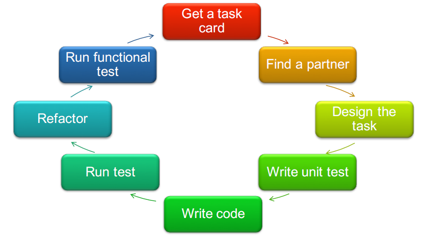

#### Pair programming in XP
* Programmers work in pairs, sit together to write every line of code
    * 2 programmers + 1 Computer = atomic unit of XP code development
    * One person at the keyboard, other supporting
    * Pairs are created dynamically
    * Egoless development
* Informal review process: each line of code is looked at by at least two people
* Productivity is similar to that of two people working independently
* Common ownership of code
    * Individuals are not help responsible for problems with the code.
* Collective responsibility for the system
    * Team has collective responsibility for resolving problems
* Spreads knowledge across the team
    * Reduces risk if someone leaves
* Motivates refactoring as the whole team will benefit from it

### Testing
#### Testing in Agile Development
* Testing in Agile Development
    * Testing the software continuously throughout development
* Agile development does not have a separate test phase
* Developers write automated repeatable unit tests
    * Testing done as part of the build
    * Ensures all features are working each time as build is produced
        * Builds should be regular, at least daily
    * Integration is done as you go too
* These actions keep the software in a releasible condition throughout the development
    * Can be shipped whenever appropriate
### Testing in XP
* The XP agile methodology recommends test driven development
    * Writing tests before writing code
* Testing can still be done by professional testers
    * In agile development testing is more quality assurance than purely testing
* Testing is central to XP and XP has developed an approach where the program is tested after every change has been made
* XP testing features:
    * Test-first development
    * Incremental test development from scenarios
    * User involvement in test development and validation
    * Automated test harnesses are used to run all component test each time that a new release is built.
#### Test-first development
* Writing tests before code clarifies the requirements to be implemented
* Tests are programs rather than data
    * Executed automatically
    * Usually with a testing framework such as **junit**
* All previous and new tests are run automatically when new functionality is added, thus checking that the new functionality has not introduced errors
### Customer Involvement
* Role of the customer in testing is to help develop acceptance tests for the stories implemented in the next release of the system
* All new code is therefore validated to ensure that it is what the customer needs
* Customers have limited time available
    * Cannot work full-time with the development team
    * May feel that providing requirements was enough of a contribution
    * May be reluctant to get involved in the testing process
#### XP Testing Difficulties
* Programmers prefer programming to testing
    * Somtimes they take shortcuts when writing tests
        * For example, they may write incomplete tests that do not check for all possible exceptiosn that may occur
* Some tests can be very difficult to write incrementally
    * In a complex user interface, it is often difficult to write unit tests for the code that implements the 'diaply logic' and workflow between screens
* It is difficult to judge the completeness of a set of tests
    * You may have a lot of system tests but your test set may not provide complete coverage
* What are XP/Agile Programmers testing for?
    * They don't have a detailed spec to test against, so how can they possibly test it?
* Agile testing therefore calls for more judgement from a tester
    * Not just a case of following a test script
    * "testathon" - collaboartive programmer brainstrom to write software tests

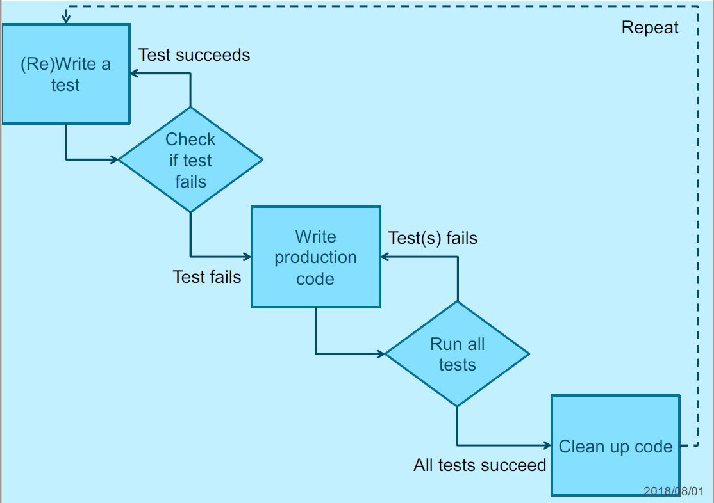

#### Test First Development
1. Quickly add test for new feature
    * Just enough code to fail
2. Run your tests
    * The complete test suite or
    * (for speed) a subset, to ensure that new test does in fact fail
3. Update the functional code to make it pass the new tests
4. Run the tests again
    * If they fail update the functional code and retest
5. Once the tests pass start over
    * Possibly refactoring any deuplication out of the design
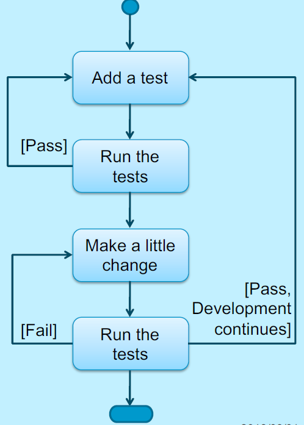

#### Test Driven Development
* TDD can be described as 
    * TDD = TFD + Refactoring
* TDD turns traditional development around
    * Instead of writing functional code first and then your testing code an afterthought
    * You first write your test code before your functional code
* Also you do so in very small steps
    * One test and a small bit of code at a time
* With TDD a developer refuses to write a new function unless there is a test that fails because that function isn't present
    * Refuse to add even a single line of code until a test exists for it
* Once the test is in place do the work required to ensure that the test suite now passes
* Once your code works, refactor it to ensure that it remains of high quality
* The diagram show how you perform test driven development:
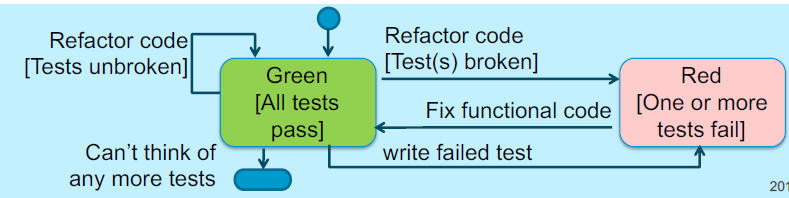
##### The Rules
1. Write new code **only** when an automated test fails
2. Eliminate any duplication
* Generates complex individual and group behaviour. Some technical implications are:
    * You design organically, with the running code providing feedback between decisions
    * You write your own tests because you can't wait 20 times per day for someone else to write a test
    * Your development environment must provide rapid responses to small changes
    * Your designs must consist of highly cohesive, loosely coupled components
        * This makes evolution and maintenance of the system easier
##### Unit Tests
* Implication: developers need to learn how to write effective unit tests
* Experience is that good unit tests
    * Run fast
        * Have short setups, run times and break downs
    * Run in isolation
        * You should be able to reorder them
    * Use data to make them easy to read and understand
    * Use real data when they need to 
        * Copied of production data
    * Represent one step towards your overall goal

* Most programmers don't read the written documentation for a system
    * Instead they prefer to work with the code
* When trying to understand a class or operation most programmers will look for sample code that invokes it
* Unit tests provide a working specification of the functional code
* Unit tests become a significant portion of the technical documentation
##### Conclusion
* Test-driven development is a development technique where ou must first write a test that fails before you write new functional code
### Refactoring
#### XP and Change
* Conventional wisdom in software engineering is to design for change. It is worth spending time and effort anticipating changes as this reduces costs later in the life cycle.
* XP, however, maintains that this is not worthwhile as changes cannot be reliably anticipated.
* Rather, it proposes constant code improvement (refactoring) to make changes easier when they have to be implemented.
#### What is refactoring
* Refactoring is defined as
    *   a change made to the internal structure of software to make it easier to understand and cheaper to modify without changing its observable behaviour
*   Adding functionality does not change existing code, it only adds new capabilities
    *   measure progress by adding tests and getting the tests to work
*   Refactoring does not add functionality, you only restructure the code
    *   don't even add any tests - only srestructur code
*   These software improvements are made before there is an immediate need for them
#### Refactoring when Developing Software
* Try to add a new function
    * (oops) realize this would be much easier if the code were structured differently
* Refactor for a while 
    * The code is better structured
* Add the new function
    * get the new function working
        * it is coded in a way thats awkward to understand
        * so refactor
#### Examples of Refactoring
* Re-organization of a class hierarchy to remove duplicate code
* Tidying up an renaming attributes and methods to mkae them easier to understand
* The replacement of inline code with calls to methods that have been included in a program librarysnio

Initial Classes - Video Rental

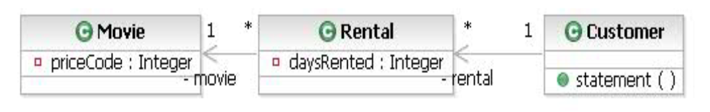

Refactored Classses Video Rental

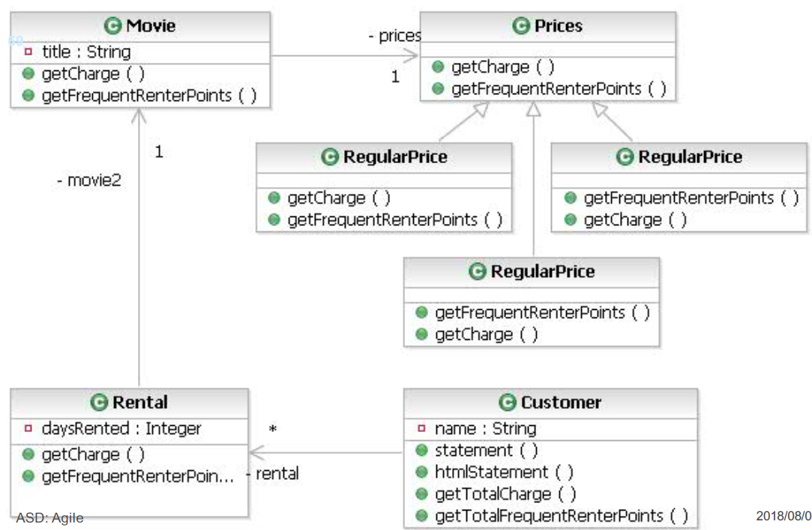

#### Why Refactor
##### Improves the Design of Software
* Deal with Software rot, decay and loss of structure
* Refactoring is like tidying up the code
    * Regular refactoring helps code retain its shape
    * You refactor code that works but is not ideally structured
* An important aspect of improving design is to eliminate duplicate code
    * Ensure the code says everything once and only once
    * More code <=> harder to modify correctly <=> mode code to understand
    * Change this bit of code here, but the system doesn't do what is expected becuase you didn't change that bit over there that does much the same thing in a slightly different context.
* Changes are easier to make becaus ethe code is well-structured and clear
##### Makes Software Easier to Understand
* Improve the understandability and readability of the software
    * Reduces the need for documentation
    * Good programmers write code understandable by human beings
* After code is written it has to be maintained
    * Someone will try to read the code and make changes
    * It matters if it takes a programmer a week to make a change that would have taken an hour if she had understood your code
* When you are trying to get the program to work, you are not thinking about that future developer
    * It takes a change in rhythm to make changes that make code easier to understand
    * Refactoring leads to higher levels of understanding that would otherwise be missed during development
##### Helps find bugs
* By clarifying the strucutre of the program you clarify certain assumptions you've made
    * To the point at which even you can't avoid spotting bugs
* Kent Beck often says about himself:
> I'm not a great programmer; I'm just a good programmer with great habits
* Refactoring helps me to be much more effective at wiritng robust code
##### Helps you program faster
* Good design is essential for rapid software development
* Changes take longer as you try to understand the ystem and find the duplicate code
* New feature need more coding as you patch over a patch that patches a patch on the original code base
* Refactoring helps you develop softwar more rapidly, because it stops the design of the system from decaying
* It can even improve a design
#### Refactoring Categories
1. Composing methods
    * The refactorings serve restructurings at the method levle
2. Moving features between objects
    * These refactorings support the moving of methods and fields between classes
3. Organizing data
    * These refactorings restructure the data organisation
4. Simplifying conditional expressions
    * These refactorings simplify conditional expressions
5. Making method calls simpler
    * These refactorings simplify method calls
6. Dealing with generalization 
    * These refactorings help to organise inheritance hierarchies
#### Refactoring to Patterns
* Refactoring to Patterns is the marriage of refactoring with patterns
    * Patterns $\equiv$ classic solution to recuring design problems
* Use patterns to improve an existing design
    * Better than using patterns early in a new design
* This is compatible with XP's desire to avoid too much upfront design
### Conclusion
* The traditional view is that refactoring is a waste of resources
#### Collaboration with Users
* Agile development relies on close cooperation and collaboration between all team members and stakeholders.
    * Keep requirements and documentation lightweight
    * Acknowledge that change is a normal and acceptable reality in software development
    * Required to clarify requirements just-in-time
    * Keep all team members on the same page throughout the development
* You can't do away with a big spec up-front and not have close collaboration
#### Agile method applicability 
* Product development where a software company is developing (medium-sized) product for sale
* Custom system development within an organisation, where there is a clear commitment from the customer to become involved in the development process and where there are not a lot of external rules and regulations that affect the software
#### Problems with agile methods
* It can be different to keep the interest oc customers who are involved in the process
* Team members may be unsuited to the intense involvement that characterizes agile methods
* Prioritising changes can be difficult where there are multiple stakeholders
* Maintaining simplicity requires extra work
* Contracts may be a problem as with other approaches to iterative development
* Because of their focus on small, tightly-integrated teams, there are problems in scaling agile methods to large systems
#### Agile methods and software maintenance
* Most organisations spend more on maintaining existing software than they do on new software development
    * So agile methods have to support maintenance as well as original development
* Two key issues
    * Are systems that are developed using an agile approach maintainable, given the emphasis in the development process of minimizing formal documentation?
    * Can agile methods be used effectively for evolving a system in response to customer change requests?
* Problems may arise if original development team cannot be maintained
#### Plan-driven specification and development
* A plan-driven approach to software engineering is based around separate development stages with the outputs to be produced at each of these stages planned in advance
* Not necessarily waterfall model, plan-driven, incremental development is possible
* Iteration occurs within activities

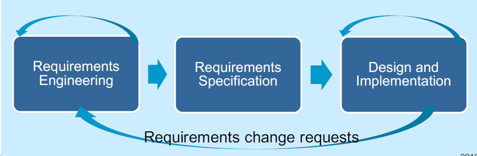

#### Agile specification and development
* Specification, design, impementation and testing are inter-leaved
* Outputs from the development process are decided through a process of negotiation during the software development process

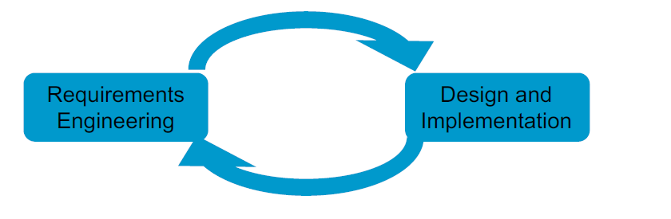

#### Architecture Change and Refactoring
* Changes that require architecture refactoring is very expensive
* It is hard to do
* It has consequences for the code and implies code refactoring
#### Summary - Points to consider
##### Principles of Agile Methods
1. Active user involvement is imperative
2. The team must be empowered to make decisions
3. Requirements evolve but the timescale is fixed
4. Capture requirements at a high level, lightweight and visual
5. Develop small, incremental releases and iterate
6. FOcus on frequent delivery of product
7. Complete each feature before moving on to the next
8. Apply 80/20 rule
9. Testing is integrated throughout the project lifecycle - test early and often
10. A collaborative & cooperative approach betwen all steakholders is essential
##### Active User Involvement
* Requirements are clearly communicated and understood at the outset
* Requirements are prioritized appropriately, based on the needs of the user and market
* Requirements can be clarified daily with the project team, not from lengthy documents that arent read or are misunderstoood
* Emerging requirements can be factored into the development schedule with the impact and trade-off decisions understood
* The right product is delivered
* As iterations are delivered, check they meet user expectations
* The product is more intuitive and easy to use
* The user is seen to be interested in the development
* The user/business sees the commitment of the team
* Developers are accountable, share progress openly every day
* There is complete transparency as there is nothing to hide
* The user shares responsibility for issues arrising; it is not a customer-supplier relationship but a joint team effort
* Timely decisions can be made about features, priorities, issues, and when the product is ready
* Responsiblity is shared; teh team is repsonsible together for the delivery of the product
* When the going gets tough, the whole team - business and technical - work together!
##### Fixed Timescale
* No-one knows what the right solution is at the outset
    * Its practically impossible to build the right solution initially
* Traditional project fight change, with change control processes
    * Minimise and resist change wherever possible
* Agile development embraces and expects change
    * The only thing that is certain in life is change
    * Requirements are allowed to evolve, but the timescale is fixed
        * To include a neq requiremnt, or to change a requirement, the user must remove a comparable amount of wokr
    * Assumes there are enough non-mandatory features included in the original timeframes.
##### Agile Requirements are Barely Sufficient
* Contrast this to the traditional situation
    * User still has new and cahnged requirements
        * Expects the new and existing features to be delivered in the original timeframes
* Teams that don't control changes can end up with scope creep
    * One of the most common reasons for projects to fail
* Agile teams accept change and even expect it
##### Agile Development Cycle
###### Frequent Delivery 
* Agile development is about frequent delivery of products
    * Gone are 12 month projects
    * a 3-6 month project is strategic
* Consider web
    * Products are released early with basic features
    * In the web 2.0 its perpetual beta
        * derive some benefits early
        * get feedback
        * look at metrics -> find what works/doesn't
        * before building "everything"
###### Regular Release Cycle
* Allows you to learn more effectively
* Estimates might be good or bad but they should be consistent
    * Estimate features at a granularity of less than 1 day and track your performance
    * You'll begin to udnerstand your delivery rate
    * You'll be surprised at how predictable you cab be
* Managing expectations is about predictability
    * If people know what to expect, they're gnerally happy
    * If they don't theyre not happy
* Focus on frequent delivery of product
* Even more importantly, focus on consistent delivery
##### eXtreme Programming (XP)
1. Whole Team: remove barrier between customer and the rest of the dev team
2. Metaphor: Common analogy for the system
3. Planning Game: planing specifies the next step
    * As the project progresses get a better and better picture of what will be accomplihed
    * Client expresses goals through user stories - overall behaviours of the software
    * Development takes storeis and estimates costs
    * Client prioritises stories
4. Simple design - as simple as the current level of functionality allows. No extraneous complexity allowed
    * When the code becomes too unwieldy its time for refactoring 
    * Design only extend to the next iterations new features
5. Small Releases: XP development teams release tested, working code, very frequently
    * Each iteration - 2 weeks - the client gets new code
    * Client evaluates it and dictates the next delivery
6. Consumer Test - The customer develops acceptance tests to see if software meets user stories
    * Tests are automated and used frequently by the developers
7. Pair Programming
8. Test Driven Development
9. Design Improvement - refactoring code whenever deficiencies are noticed = improving the design of the existing code
10. Collective code ownership: immaterial who wrote the code; anyone can modify it at any time
    * Whoever notices a problem, fixes it
11. Continuous Integration: At all times the system compiles, runs and passes all tests
12. Sustainable Pace: Same amount of work and effort in every iteration
    * Overtime leads to burnout, mistakes and more burnouts
13. Code standard - adopt some coding standard that is consistently adhered to
##### TDD
* Programming technique ensuring that code is thoroughly unit tested if a test fails then progress has been made: you know what to fix
    * Clear measure of suxxess when the test no longer fails
* TDD increases confidence that the system meets the requirements
* Side effect of TDD is you achieve 100% coverage test
    * Every single line of code is tested
    * Not guaranteed with traditional testing
* Does not replace traditional testing: just effective unit testing
* Side effective of TDD: the resulting tests are working examples for invoking the code -> provides a working spec for the code
## Lecture 8
### Introduction
#### What is Scrum?
* Not an acronym
* Very little to do with rugby
* Simple to implement
* Designed to increase productivity
* Mature: from 1995 (feck, then I am mature)
* Scaleable
    * Can be used oon projects of any size
* Scrum is a **project management process**
* It is a lightweight development process to
    * Manage and control software and product development
* Embraces iterative and incremental practices
* Not "artefact-driven"
    * No large requirements documents, analysis specifications, design documents
    * Requires very few artefacts
    * It does require discipline
* Concentrating on achieving results
#### Warning
* No silver bullet
    * That is, it ain't a technique that compensates for lack of training or experience
* Scrum is not a panacea for all known development ills
    * A hot topic in the software and ames industry
> Panacea - solution to everything
#### Why Scrum?

#### Waterfall v Scrum
> Don't use waterfall

Waterfall Sample Project

Waterfall Functionality of Project

Scrum Sample Project

Scrum Functionality of Project

### Scrum Outline
#### Scrum Skeleton

* The lower circle represents an iteration of development that occur one after another
    * Output of each iteration is an increment of product
* The upper circle represents the daily inspection that occurs during the iteration
    * Individual team members meet to inspect each others' activities and make appropriate adaptations.
* Driving the iteration is a list of requirements
* This cycle repeats until the project is complete

* Product features are broken down into individual tasks by programmer team
* Worked on for an iteration of (two weeks to) a month
* Account for their tasks and to each other in a daily meeting
* End of the iteration a product review occurs of all work done in that iteration
* Project directors and publishers determine how to prioritize the next iteration bsed on the work done in the latest
* The heart of Scrum lies in the iteration
* The team
    * Takes a look at the requirements
    * Considers the available technology
    * Evaluates its own skills and capabilities
    * Determine how to build the functionality, modifying its approach daily as it encounters new complexities, difficulties and surprises
* This creative process is the heart of the Scrum's productivity
#### Scrum Roles
* There are only three SCRUM roles
1. Product Owner
2. Team
3. ScrumMaster
* All involved are Players or Spectators
    * Players - committed, accountable, responsible
    * Spectators - interested, consults, informed (management)
##### Product Owner
* Represent the interests of everyone with a stake in the project and its resulting system
    * Achieves initial and ongoing funding
    * creates
        * The project's initial overall requirements
        * Return on investment (ROI) objectives
        * release plans
##### Product Owner & Product Backlog
* List of requirements is called the Product Backlog
* Product Owner uses the Product Backlog to ensure the most valuable functionality is produced first and built upon
    * Achieved by frequently prioritizing the product backlog to queue up the most valuable requirements for the next iteration
##### Scrum Team
* Typically will be ten or fewer
    * Larger teams can work well if they understand how to organise and manage themselves
* Responsible for developing functionality
* Are self-managing, self-organising, cross functional
* Responsible for deciding how to turn Product-Backlog into an increment of functionality within an iteration
* Managing their own work to do so
* Members are collectively responsible for the success of each iteration and the project as a whole
##### Scrum Master
* Responsible for the Scrum process
    * Teaching Scrum to everyone involved in the project
    * implementing Scrum so that it fits within an organization's culture and still delivers the expected benefits
    * ensuring that everyone follows Scrum rules and practices
### Scrum Flow
#### Scrum Rules
* ScrumMaster ensures everyone on a project follows the rules
* Hold the process together so everyone knows how to play
    * If rules aren't enforced, people waste time figuring out what to do 
    * If the rules are disputed, time is lost while everyone waits for resolution
* The rules have worked in thousands of successful projects
* To change rules, use Sprint retrospective meeting:
    * Changes should originate from the Team, not management
    * Changes should be entertained if and only if the ScrumMaster is convinced everyone involved understands how Scrum works
    * No rule changes until the ScrumMaster determines this stage has been reached
* Any project starts with a vision
    * In XP terms the "System Metaphor"
    * Leads to the logical architecture
* The Product Owner produces the Product Backlog
    * List of functional and non-functional requirements when turned into functionality deliver the most vision
    * Prioritised with the items most likely to generate value as top priority and divided into proposed released
##### Sprints
* Work is done in Sprints
    * Iteration of 30 consecutive calendar days
    * Initiated with a Sprint planning meeting
        * The product owner and team collaborate about what will be done for the next Sprint
            * Selecting from the highest priority Product Backlog
            * Product Owner tells the Team what is desired
            * Team tells the Product Owner how much it believes it can turn into functionality over the next sprint
        * Cannot last longer than eight hours
            * Prevent hand-wringing about what is possible
    * Goal is to get to work, not to think about working

### Scrum Meetings
#### Sprint Planning
People planing for the 30 day sprint
Who do we give them to, and how do we give them to people

##### Time Boxed
* Sprint planning meeting is time-boxed to 8 hours
    * Consist of two segments time-boxed to 4 hours each
        * The first segment is for selecting product backlog
        * the second is for preparing a sprint backlog
##### Meeting
* The goal of the first segment is for the Team to select those Product Backlog items that it believes it can commit to turning into an increment of potentially shippable product functionality
* The team will demonstrate this functionality to the Product Owner and stakeholders at the Sprint review meeting at the end of the Sprint
* The team can make suggestions, but the decision of what Product Backlog can constitute the Sprint is the responsibility of the Product Owner
* The team is responsible for determining how much of the Product Backlog that the Product Owner wants worked on the Team will attempt to do during the sprint

**First Four Hours** - Deciding what to do
* Product owner presents the highest priority Product Backlog to the Team
* Team questions the content, purpose, meaning and intentions of the product backlog
* Team selects as much Product Backlog as it believes it can turn into a completed increment of shippable product functionality by the end of the Sprint
* Time-boxing the segment to 4 hours means this is all of the time available for analysing the Product Backlog
* Further analysis must be performed during the Sprint
* Large-grained, high-priority Product Backlog with imprecise estimates might not be thoroughly understood during this part of the Sprint planning meeting
    * Might result in the Team not being able to complete all of the Product Backlog that it selects

**Second four hours** - planning the Sprint
* Team is responsible for managing its own work
    * Needs a tentative plane to start the Sprint
    * Chosen tasks are placed in a Sprint Backlog
    * Tasks in the Sprint Backlog emerge as Sprint evolves
* Product Owner is available to answer questions from the team
* Team work out how to turn the selected backlog into an increment of potentially shippable product functionality
    * Everyone else only observes or answers questions for more information
* Output of the 2nd segment is a list: the Sprint Backlog
    * Tasks, task estimates and assignments
* Task list might not be complete
    * It must be complete enough to have commitment of all Team Members
    * Carries them through the first part of the sprint
    * while the team devises more tasks in the Sprint Backlog
#### Daily Scrum
##### Meeting
* Time boxed to 15 minutes
    * No matter how many team members
* Held in the same place at the same time every work day
    * Best is first thing in the day so members think of what they did the day before and what they plan to do today
* All Team members are required to attend
    * If a team member can't attend, the absent member must either attend by telephone or by having another Team member report on the absent member's status
* Why daily?
    * Scrum creates daily visibility of issues
* Team members must be prompt
    * Master starts the meeting at the appointed time, regardless of who is present
* ScrumMaster goes round the room until everyone has reported
* Each team member responds to only **3 questions**?
1. What have you done since the Daily Scrum?
2. What will you do on the project between now and the next Daily Scrum meeting?
3. What stands in the way of your meeting your commitments to this sprint and this project?
* Purpose
    * Synchronize the work all the team members daily
    * Schedule any meetings needed to help progress
* Team members should not digress into issues, designs, discussion of problems or gossip
* The ScrumMaster is responsible for moving the reporting along briskly, from person to person
* In the Scrum only one person talks at a time
    * The one who is reporting their status
    * Everyone else listens - no side conversations
* If a Team member reports something of interest to other members or needs assistance, any Team member can arrange a meeting afterwards for interested parties
##### Time Boxed
* Time boxed to 30 days 
    * Time needed for a team to build something of significant interest to the Product Owner and stakeholders and bring it to a state where it is potentially shippable
    * The maximum time to do work without artefacts and documentation to support thought processes
    * maximum time that most stakeholders will wait
        * Without losing interest in the team's progress
        * Without losing their belief that the team is doing something meaningful 
##### Sprint
* During the sprint
    * The team can seek outside advice, help, information and support
    * No one can provide advice, instructions, commentary, or direction to the Team
    * The Team is self-managing
* The team has committed to the Product Backlog
    * No one is allowed to change the Product Backlog during the Sprint
    * The Product Backlog is frozen until the end of the Sprint
##### Backlog
* If the team feels unable to complete all the committed Product Backlog
    * Can consult with the Product Owner on which items to remove
        * If so many items require removal that the Sprint has lost its value, the ScrumMaster can terminate the Sprint, as previously sated.
* If the Team determines that it can address more product Backlog
    * Can consult the Product Owner on which additional items to be added
##### Non-viable
* If the sprint proves not to be viable, the SM can terminate the Sprint and initiate a new S planning meeting
    * The SM can make this change if requested by the Team or Product Owner.
    * THe Sprint can prove to be not viable:
        * If the tech proves unworkable
        * If the business conditions change so that the Sprint will not be of value to the business
        * If the team is interfered with during the Sprint by anyone outside the team
##### Team Responsibility During a Sprint
* The team members have two administrative responsibilities during the SPrint
    * Attend the daily Scrum meeting
    * Keep the Sprint Backlog up-to-date and available in a public folder, server - visible to all
        * New tasks must be added to the Sprint Backlog as they are conceived, and the running, day-to-day estimated hours remaining for each task must be kept up-tp-date
##### Review Meeting
* Time-boxed to 4 hours
    * Team should not spend more than 1 hour preping for Sprint review
    * The purpose is for the Team to present to the Product Owner and stakeholders functionality that is done
    * Done usually means that the functionality is completely engineered and could be potentially shipped or implemented
        * If "done" has another meaning, make sure tha tht product owner and stakeholders understand it
* Sprint review is spent with Team members presenting functionality, answering stakeholder questions, and noting changes that are desired
* At the end of the presentations, the stakeholders are polled to get their impressions, any desired changes, and the priority of these changes
* The Product Owner discusses with the stakeholders and the Team potential rearrangement of the Product Backlog based on the feedback
* Stakeholders are free to voice any comments, observations, or criticisms regarding the increment of potentially shippable product functionality between presentations
* Stakeholders can identify functionality that wasn't delivered or was not up to their expectations and request that such functionality be placed in the Product Backlog for prioritization
* Stakeholders can identify any new functionality that occurs to them as they view the presentation and request that the functionality be added to the Product Backlog for prioritization
* At the end of the Sprint review, the SM announces the place and date of the next Sprint review to the Product Owner and all stakeholders
##### Retrospective
* Sprint retrospective meeting is time-boxed to 3 hours
* attended only by the Team, SM and Product Owner (optional)
* Start the meeting by having all team members answer two questions:
> What went well during the last Sprint?
> What could be improved in the next Sprint?
* SM writes down the Team's answer in summary form
* Team prioritizes in which order it wants to talk about potential improvements
* SM is not at this meeting to provide answers but to facilitate the Team's search for better ways for the Scrum process to work for it
* Actionable items that can be added to the next Sprint should be devised as high-priority non-functional product backlog

### Process Artefacts
#### Process Overview
Burndown Chart
#### Scrum's Artefacts
* Scrum has few artefacts
    * Product backlog
    * Sprint backlog
    * Burndown charts
* Can be managed using an Excel spreadsheet
    * More advanced / complicated tools exits
        * Expensive
        * Web-based - no good for the project manager who traverls
        * Still under development
#### Product Backlog
* Prioritised list of first cut refinements
* The product Owner is free to
    * Adjust the order in which Product Backlog items are developed
    * Add new items
* The brings in the concept of agility and change
#### Sprint Backlog
* List of things that will be "done" during the Sprint
* Each item hs an estimate of how long it should take to complete, usually measured in hours
* During the Sprint's 30 day period, the Project Team must update the Sprint Backlog
* Keeping the Sprint Backlog updated is key
    * Not only does it allow us to work out how fast a team can work (their velocity), it is an early warning indicator

#### Burndown Charts
* These are used to identify the rate that work is being completed
* Graphical representation of the sprint backlog
* It illustrates the work done
* Demonstrate a steady drive to zero hours remaining:
    * It represents a pace of work that should be sustainable
    * However, some work takes longer than others
    * Some are even shorter
    * May not be a perfect straight line
* Initially in a sprint there is no work done so that chart is as follows:

Ideally it should look as follows:

Although, if work is done too slowly it can look as follows:

Alternatively, it can be too fast - which would look as follows:

### Possible Problems
* Sprints are not always the same length
    * On a well executed Scrum project the team establishes a natural rhythm
    * Each sprint must be the same length
#### Loss of Rhythm
* If sprints are sometimes two weeks and sometimes four weeks then the natural rhythm is never established
    * Sprints then begin to feel like arbitrary units of time with endpoints selected more by outside forces rather than designed to enhance overall productivity of the team
* When the sprint duration is allowed to vary teams have a harder time selecting the right amount of work for the sprint backlog, which results in less commitment to completing all of the items in the sprint

#### Specialized Job Roles
* A project team has specialized job roles such as architect, designer, DBA or tester
    * Scrum teams need to have a "we're all in this together" attitude
        * This can be undermined if a team has specialized job descriptions or roles
    * It is simplistic to think that everyone can be a DBA and everyone can write server-side J2EE or .Net code
* A successful Scrum team does not need to be comprised entirely of generalist
    * However, each specialist must accept general responsibility for the system as a whole
#### Scrum is for SM
* The daily Scrum feels like a status update from the team members to the SM
    * It feels as though it exists solely for the SM
    * Sm takes notes about who committed to what work and why some other task wasn't completed
    * These daily meetings feel like status meetings
* Two main purposes of the daily scrum
    * To provide a coordination mechanism for everyone on the project
        * Everyone hears where everyone else is
    * Each team member makes commitments in front of his peers
    * If the commitment is not fulfilled it is not the SM's to rebuke the team member
        * They should feel bad enough
#### SM Assigns work
* Work is assigned by the SM rather than signed up for by developers
    * Self-organisation is one of the underlying principles of Scrum
    * When a SM assigns work it undermines the responsibility developers assume when they are allowed to self-organise around the achievement of a goal
    * Even an occasional assignment from a SM can do a lot of damage
    * Teams need to feel completely in control of their own work
#### Chickens & Pigs
I really didn't like this metaphor, so I included it in another PDF -> [here](docs/pigs&chickens.pdf)