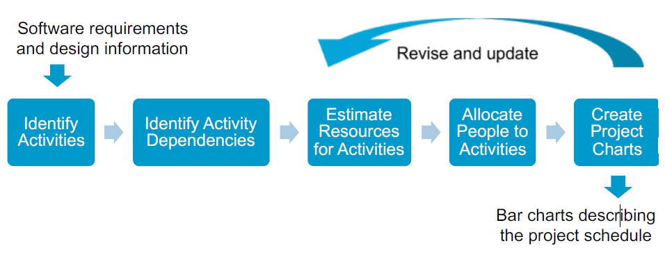
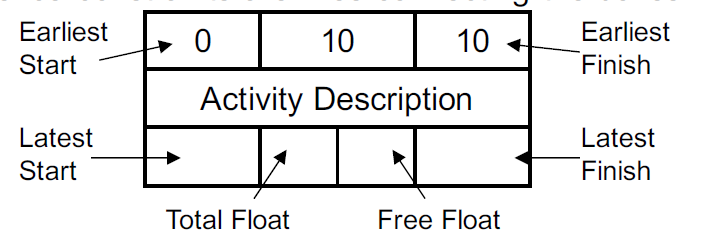
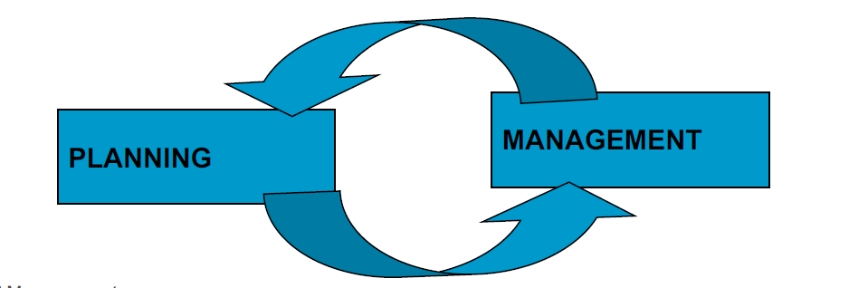

# CSC3003S Notes
# Lectures
## Lecture 1
### Advanced Software Development
JonJon Clark - clrjon005@myuct.ac.za
**Topics**
* Requirements Gathering
* Software Design
* Documentation
* Coding
* Testing
* Bug Fixing
### The Process of Software Engineering
**Definition**
* The establishment and use of effective engineering principles in order to obtain software that is reliable and works efficiently on real machines.
* The application of a sytematic, disciplined, quanitifiable approach to the development, operation, and maintenance of software.
### Topics
1. Review O-O & UML
2. Project Management
3. Software Development Methodologies
4. Agile Software Development
5. Software Development with SCRUM
6. Case Study: SCRUM in Game Development
7. UML, Patterns and Architecture
8. Software Architecture
9. Design Patterns
10. Open Source
11. Validation/Verification
### Guest Lectures Thursdays
### What is version/source control?
* Version control systems are a category of software tools that
help a software team manage changes to source code over
time.
* keeps track of every modification to the code in a special kind
of database
* If a mistake is made, developers can turn back the clock and
compare earlier versions of the code to help fix the mistake
while minimizing disruption to all team members
### source Control
Managing a codebase with lots of simultaneous contributors
| Distributed                                  | Centralized                                           |
| -------------------------------------------- | ----------------------------------------------------- |
| Mercurial (hg),git                           | CVS, Subversion                                       |
| Work in local repository, sync changes later | Repository exists on a client server, work on clients |
### Web-based hosting service for version control using Git
* Bitbucket
* Github
* [Gitlab](gitlabcs.uct.ac.za)
## Lecture 2
### Advance Software Design: Project Management
* Concerned with activities involved in ensuring software is delivered on time and on schedule and in accordance with the requirements of the organisations developing and procuring the software.
* Project management is needed because software development is always subject to the **budget and schedule constraints** that are set by the organisation.
* Read [Bennet Chapter 22](/docs/BennetChapter22.pdf)
* Systems Development is a complex activity that requires careful project management
* Inter-dependencies between the artefacts of softwaree development
    * production has to be planned, monitored and co-ordinated
    * So that software development is efficient, effective and on time.
    * E.g.: when would you start build the Chess AI?
* A software development project may involve many developers, some with specialized skills who will be required at different times.
* Activites must follow a particular sequence.
    * For example,  testing a system can only begin when at last some elements have been constructed.
    * Test scripts and test harness may be prepared earlier in the project
### No Silver Bullet
There is no technique that fixes the inherent complexity of software design and development.
### Project Management Tools
* Basecamp
* Freedcamp
* TeamGantt
* Asana
* Overleaf
### Scope of a Project
* The functions and features that are to be delivered to end-users
* The data that are input and output
* The content that is presented to users as a consequence of using the software
* The performance, constraints, interfaces and reliability that bound the system
### Defining Scope
* Scope is defined using one of two techniques
    * A narrative description of software scope is developed after communication with stakeholders
    * A set of use-cases is developed. A use-case is a scenario-based description of the user's interaction with the software from the user's point of view.
* Performance considerations encompass processing and response time requirements.
* Constraints identify limits placed on the software by external hardware, available memory, or other existing systems.
### Determining Feasibility
* Given the scope, determine the resources required.
    * Cost
* Make sure you have an answer to the question:
    * Do we have the resources we need to build this software?
* Resources are:
    * People
    * hardware and software tools
    * reusable components.
### Project Planning Goals - Aka scope
* Goals are derived from the needs and expectations of stakeholders:
    * Project sponsor
    * customer for deliverables
    * Users of the project outputs
    * project manager and project team
* Find true needs that create real benefits
    * Prioritize them
* Create measurable goals
    * S - Specific, significant, stretching
    * M - Measurable, meaningful, motivational
    * A - Agreed upon, attainable, achievable, acceptable, action-oriented
    * R - Realistic, relevant, reasonable, rewarding, results-oriented
    * T - time-boxed, time-based, time-bound-timely, tangible, trackable.
### Project Planning Deliverables
* Deliverables are a list of items that have to be delivered to meet the goals
    * Verifiable and specific
    * Can be report, equipment acquisition or Executable code module etc
    * Has a stakeholder who needs it
* Say when it has to be delivered
* Give quality standards
    * document is according to specified format
### Project Planning Schedule
* The effort required (in terms of time)
* The people required (and other resources)
* Update deliverables with this & work schedule out
* If the schedule is unrealistic you can justify some of the following:
    * Renegotiate deadline - delay
    * Additional resources - more expensive
    * reduce scope - fewer deliverables (only thing that makes sense for capstone - carefully determine your scope)
### Project Planning Supporting Plans
Human Resource Plan
* Name key individuals and orgs: describe rols and responsibilities
* Describe the number and type of people needed
    * Start dates etc

Communication and Management Plan
* Who needs to be kept informed about the project
* How they will receive the information?
    * Weekly review meeting
    * progress reports
    * revised schedule
  
Risk Management Plan
* Identify as many risks as possible
* Be prepared if something bad happens

Marketing Plan
* Important to get funding

### The Range of Management Activities
**P**eople
* Managers, Project Managers, Team Leaders, Software Team, Customers, End-Users
**P**roduct 
* Scope and decomposition
**P**rocess
* SDLC: initiation -> Analysis -> Design -> Construct -> Test -> Implement 
* UP: Inception -> Elaboration -> Construction -> Transition -> Production
**P**roject
* Size estimation, scheduling, risk management, tracking

### People
#### Roles and Responsibilities
It seems obvious that a team needs people with different skills
* Range of duties in a small project
    * Project management: Strategist, Leader, Politician, Project Facilitator, Administrator
    * Systems analysis: Stakeholder needs, Interaction Designer, Cost estimator
* User interface designer, user stories
* Architect: Application overview, performance
    * Middleware —software layer between the operating system and the applications on a distributed computer network
* Specialists as required: database, games engine, mobile development, …
* Documentation: Amanuensis

##### Essential Roles in Small Software development teams
1. Course developer - prep and coordination of training.
2. Database designer - essential to the process, mainly due to the specific nature of its knowledge
3. Implementer - programs sub-systems and components that support
4. Integrator (lead programmer) - responsible for maintaining the implementer' awareness of the project context, for identifying the tasks to be undertaken and for appointing th eperson responsible for each one. Also responsible for the initial definition of the critical dates of the project and for developing a plan for the integration of the sub-systems, to allow the project manager to inform th eclient when each feature is expected to be available.
5. Process Engineer - mainly concerned with the management of the dev process, its adaptation to org context and monitoring its implementation, in order to identify and implement process improvements.
6. Project Manager - Assume a global overview of the project through a detailed interaction with the internal and external participants. Must create the conditions for the project to achieve success, by ensuring timeliness and fulfilment of all commitments. Requires: basic knowledge in management; knowledge about the client’s business domain; project management methodologies and negotiation skills.
7. Project reviewer -  This role cannot be considered critical, however, due toresponsibilities related to the verification and approval of several artefacts produced by other participants, and possible conflict of interests, this person cannot have another role within the project
8. Software Architect -  Responsible for setting the technological foundation onwhich the project implementation should be based. The software architect is responsible for managing the technical risks.
9. Systems Administrator -  Focused on ensuring the provision of the infrastructure needs (e.g., PCs for developers, servers, etc.)
10. Systems Analyst - Scope management. Identify and document the requirements (functional or non-functional). Understand the client'sbusiness domain and to perceive the real motivations and relevance of the requirements.
11. System tester - Entrusted with very different tasks, like review of documentation and testing behaviour. 
12. Test Manager - Responsibility is to ensure the product quality by devising a plan for internal quality audits and implementation. Cannot have other roles, particularly with those roles related to the design and construction.
13. UI designer - The scope of this role in a project varies according to the nature of the artefacts to be developed.
#### Choosing People
* Information from candidates about their background and experience
    * Best evidence to judge suitability
#### Managing with different Personality Types
* Backgrounds and personality styles of team members
* Management styles of customers and developers
* Realize tha other people are not like you
#### Management and Team Success
* Most software engineering is a group activity
    * Non-trivial software projects cannot be done by one person
    * People motivated by success of the group and their own personal goals
* Individual success depends on:
    * Ability and interest to work hard
### Estimation and Metrics
#### Milestones and Deliverables
* Activity - Task that takes time
    * Duration - length of time needed for an activity
    * Due date - date for completion of the activity
    * Precursor - activity which precedes others that depends on it
* Milestone
    * Completion of an activity
    * Recognisable end-product of a task
        * Hand over system for testing
    * Requires a formal, measurable output
* Deliverable
    * A project result that is delivered to customer
* Milestone vs Deliverable
    * Deliverable is a measurable and tangible outcome of the project. They are developed by project team members in alignment with the goals of the project.
    * Milestones on the other hand are checkpoints throughout the life of the project. They identify when on or multiple groups of activities have been completed thus implying that a notable point has been reached in the project.
#### Why Software Metrics?
* To plan and manage a software development project
    * Need to estimate the resources required for each of its constituent activities
        * Subjective perceptions of the activity
        * Based upon measurements of size and complexity
            * Activity itself
            * Artefact that is produced
    * Software metric measures some aspect of software development
        * Project level - cost or duration
        * application level - size or complexity
#### Software Metrics Characteristics
* Process Metrics
    * Process metrics measure some aspect of the development process
        * Project cost to date
        * amount of time spent so far on the project
        * (These change all the time)
* Product Metrics
    * Product metrics measure some aspect of the software product.
        * Analysis model
            * number of classes in an analysis class diagram
        * test plans
        * program code
* Result Metrics
    * Measure outcomes
        * Current cost of a project 
    * Also known as control metrics
        * used to determine how management control should be exercised
            * Measurement of the current level of progress in the project is used to decide whether action is necessary to bring the project back onto schedule.
* Predictor Metrics
    * Quantify estimates for project resource requirements
        * Class size
            * A crude measure might be a simple count of attributes and operations.
            * Predictor because it can be used to predict the time that it will take to produce code.
    * Also measure of some aspect of a software product that is used to predict another aspect of the product or project progress.
        * Predict that the system will be difficult to maintain
        * Predict very low levels of reuse
        * Change the design to improve the system
#### Are Software Metrics Worth Anything?
* Useful for prediction and resource estimation
    * Otherwise use of software metrics is rather limited
* Validity of predictor metrics is based on 3 assumptions
    * You can measure something useful
    * That measure actually predicts something worthwhile
    * The relationship is real and can be expressed in a model or a formula.
* Size metrics can be used to estimate the resource requirement for a project provided that appropriate historical data is available to derive and validate the relationship.
#### Metrics for Object Oriented Development
* Ability of a package to absorb change is partly dependent on ratio of abstract classes to all classes.
    * 0 - has concrete classes and is difficult to change
    * 1 - has no concrete classes at all (easy to change)
* Application size
    * Number of use cases
    * Number of domain classes
* Class size
    * Number of attributes
    * Number of operations
    * size of operations
### Scheduling
#### Project Scheduling
* Split the work in a project into seprate tasks
    * Minimize tasks dependencies where one tasks wait for another to complete
* Estimate the calendar time needed to complete each task
    * Split up if much longer than 1 week
    * Make tasks concurrent to make optimal use of workforce
* Estimate the effort required
    * Who will work on the tasks
    * Resources needed to complete each task
* Mostly needs project manager's intuition and experience. 

#### Critical Path or Network Analysis
* Related to PERT Charts
* Minimum overall duration of the project according to the estimates depends on the critical path(s)
* Any delay of a task on the critical path delays the whole project.
#### What is Network Analysis?
* Project Tasks
    * Often interdependent
    * But need to be done in parallel for teamwork to be effective
* Task networks are graphical depictions of task dependence
* Network analysis is a project planning method that
    * Determines the critical path
    * Establishes "most likely' time estimates
    * Calculates boundaries to stop project slippage.
#### Terminology
* Earliest Start/Finish
    * Earliest a task can begin/end if all preceeding tasks are completed in the shortest time
* Latest Start/Finish
    * Latest a task can begin/end without delaying the minimum project completion time
* Critical Path
    * Chain that determines overall project duration
    * Can be multiple critical paths (not just one)
* Slack (Float)
* The amount of surplus time or leeway allowed while still maintaining the critical path

#### Network Analysis
Tasks are shown as boxes
sequences constraints are lines connecting the boxes

* Step 1 - Label Tasks in order and indicate dependencies.
//To Do
Break these steps down into an easy to read document

## Lecture 4
### Gantt Charts
* Horizontal Bar Chats
    * Horizontal axis represents project time span
    * vertical axis represents project tasks
* Capture
    * Task completion
    * Simple dependencies
    * Milestones and Deliverables
* Can't handle complex task dependencies
* Supported by automated scheduling tools
    * Microsoft project 
* Possible options:
    * Teamgantt
    * Microsoft project
* Visualize entire project
### Risk
#### Managing Risks
* Why?
    * Projects have a high level of uncertainty
    * Better to anticipate problems in advance
* How?
    * Identify specific risks to the project
    * Analyze the risks
    * Rank them in a particular order
    * Plan for monitoring, mitigation, management
    * Revisit continually during project
#### Boehm's Top Ten Risk Items +2
* Being blindsided by the competition
* Outside interruptions
  1. Personnel shortfalls - failure to recruit or retain key staff
  2. unrealistic schedules and budgets
  3. Developing the wrong functions
  4. Developing the wrong user interfaces
  5. Gold-plating
  6. Continuing stream of requirements changes
  7. Shortfalls in externally-performed tasks
  8. Shortfalls in externally-furnished components
  9. Real-time performance shortfalls
  10. Straining computer science capabilities
#### Risk Matrix
* Sort risk by a combination of:
    * Probability (high, medium, low)
    * Impact - catastrophic (project failure), critical (massive delay), marginal, negligible

#### 3M's
* Mitigation
    * How can we void or reduce the risk?
        * Avoid the riskL change requirements
        * Transferring the risk: e.g.: buy insurance
    * Or assume the risk and accept and control it
* Monitoring
    * What factors can we track that will enable us to determine if the risk is becoming more or less likely?
* Management
* What contingency plans do we have if the risk becomes a reality
### Questions
1. Which of the following statements best describes how one goes about identifying the critical path:
    * a) Find those milestones where the earliest start time is equal to the latest start time <--- Answer
    * b) Find those milestones where the earliest start time is less than the latest start time
    * c) Find those milestones where the earliest start time is greater than the latest start time
    * d) Find those milestones with some scheduling flexibility
    * e) None of the above
2. What does the term GANTT stand for>
    * nothing
3. Which of the following statements best explains what is meant by slack time in Critical Path Analysis?
### Conclusion
#### Planning vs. Management
* Planning
    * Pre and Post
    * Network analysis, resourcing, risks, schedule
* Management
    * During
    * Controlling resources and timescales

#### Tips on Project Control
* Remember to update planning documents
    * Show progress in Gantt chart
    * Reassess risks
### Resources
* Bennett, McRobb & Farmer, Object-Oriented Systems Analysis and Design: Using UML, McGraw-Hill. Chapter 22: Managing Object-Oriented Projects.
    * Available [here](highered.mcgrawhill.com/sites/0077125363/student_view0/online_chapters.html)
* Sommerville, Software Engineering, Pearson
    * Chapter 22: Project management: Risk management, Managing people, Teamwork 
    * Chapter 23: Project planning, Software pricing, Plan-driven development, Project scheduling, Agile planning, Estimationtechniques

## Lecture 5
Software Engineering Methods
### Problems
#### Observations
* Most common problem in software systems is not the construction, but the estimation.
* Software projects fail to meet cost and schedule, because those targets are wrong.
    * Costing software is difficult
* Know little about accurate estimations so targets are unreasonable
    * Made by people least able to make them
        * e.g.: marketers, managers and customers.
* Communication is hard when ideas are abstract or conceptual

#### Software Engineering Triangle
* Time
* Scope
* Cost

## Lecture 7
Agile Development Methodologies
## Principles of Agile Methods
### Agile Manifesto
We are uncovering better ways of developing software by doing it and helping others do it.
Through this work we have come to value:
* Individuals and interactions over processes and tools
* Working software over comprehensive documentation
* Customer collaboration over contract negotiation
* Responding to change over following a plan

That is, while there is value in the items on the right, we
value the items on the left more. 

> If you can dodge a wrench you can dodge a requirement

## Fixed Timescale

### Recording User Stories

### Incremental Design
* As opposed to Fred Brooks *No Silver Bullet* Agile does not follow a top-down design method.
    * Top-down design says: time in design is worth it to save cos of reowrking the design many times.
* Agile design is always the same size as the system.
    * "You can't possibly anticipate the problems and alternatives that will arise once you start coding"
* If a new feature comes along that requires major changes then that is thetrade-off for the flexibility it allows.
    * perhaps this feature wa not even known at the beginning anyway!
    * Or it might have gone away if we knew of it at the start!

## Agile Development Cycle
* The cycle is Analyse, Develop, Test; Analyse Develop, Test
    * Doing each step for each feature, one feature at a time
> ADT

* Advantages of this approach include;
    * Reduced risk
    * Increased value: delivering some benefits early
    * More flexibility/agility
    * Better cost management
* Each feature must be fully developed, to the extent it can be shipped
* Develop features in priority order

### How Frequent is Frequent enough?
* There is no right or wrong answer
    * Decide what's appropriate; stick to a regular release cycle
        * Allows you to plan

### Done Means Done
* Features developed in an iteration, should be 100% complete by the end of the iteration
    * Ideally, each iteration results in a release
* In Agile development, *Done!* means shippable

### Working Product at All Times
* Meaning 1
    * A software product should always be ina working state
        * Not always functionally complete, just that it works and has high quality
* Meaning 2
    * The emphasis is on producing a working product and shipping it
    * Not on producing documentation that might lead to a product
* The best way to get user feedback is to give a product even if it is only work in progress
* Prototypes are better than a document
* Effort spent getting the product back to a working state is a missed opportunit to be doing valuable work
* Prototype solutions to risky problems helps to increase the chance of having a working product.
* Prototypes: an inexpensive way to try out ideas so that as many issues as possible are understood before the real implementation
* Two main classes of prototypes
    * The true prototype
        * Test implementation to udnerstand a problem before it is implemented for real
    * "tracer bullets"
        * prototype that is intended to gradually turn into the final solution
**Continuous Integration**
* An important discipline is to continuously integrate changes
    * Frequent integration helps to ensure tha modules will fit together
    * Also that the product continues to work with all the changes
* Developer have the bad habit of checking out a number of files and not checking them in again until their work is dones
    * Developers should integrate their work daily
    * This gradual introduction of changes ensures that integration problems or regresions are caught early
**Performance**
* *Don't neglect performance!*
    * Performance is a topic that generates passionate discussions in software development
    * Some people feel that code clarity is more important and that you should get the code clarity right first and then otpimize the 1% to 3% of code that needs it
    * Others feel that you should code for performance first, because if you don't, your code will always be slow

## Extreme Programming
### Principles
| Principle             | Description |
| --------------------- | ----------- |
| Incremental planning  |             |
| Small releases        |             |
| Simple Design         |             |
| Pair programming      |             |
| Collective ownership  |             |
| Continous integration |             |
| Sustainable pace      |             |
| On-site customer      |             |

### System Metaphor in Extreme Programming
* System metaphor is a mental model that everyone ...
* Metaphor is something you start using when your mother asks what you are working on and you try to explain her the details.
* Use your common sense or find the person on your team who is good at explaining techical things to customers in a way that is easy to understand.

### Pair programming in XP
* Programmers work in pairs, sit together to write every line of code
    * 2 programmers
* Productivity is similar to that of two people working independently
* Common ownership of code
    * Individuals are not help responsible for problems with the code.
* Collective responsibility for the system
    * Team has collective responsibility for resolving problems
* Spreads knowledge across teh team

## Testing
### Test-first development
* Writing tests before code clarifies the requirements to be implemented
* Tests are programs rather than data
    * Executed automatically
    * Usually 
### Customer Involvement
* Role of the customer in testing is to help develop