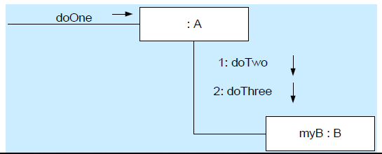
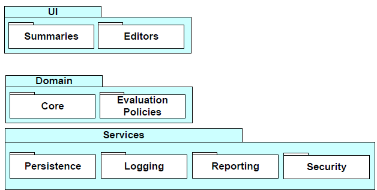
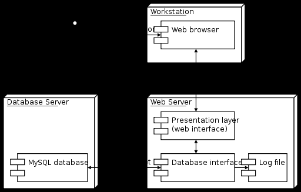
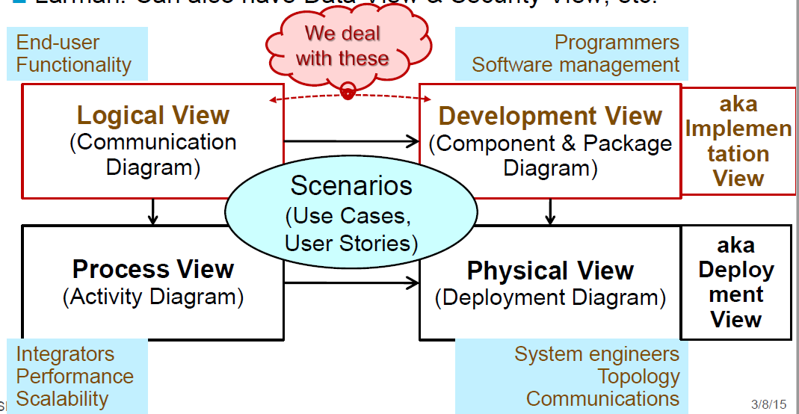
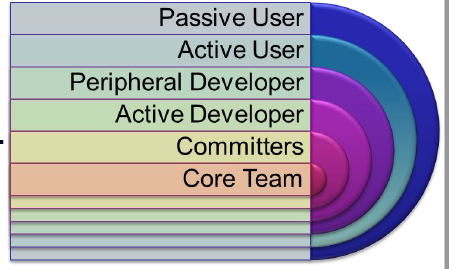

# Summary <!-- omit in toc -->
This is a summary of the content of ASD, I recommend reading through the other notes on this repository alongside this.

- [Introduction](#introduction)
    - [Software Engineering (SE)](#software-engineering-se)
        - [Elements of SE](#elements-of-se)
        - [Process of SE](#process-of-se)
- [Project Management](#project-management)
    - [Planning](#planning)
    - [Scheduling](#scheduling)
    - [Risks](#risks)
    - [Planning vs Management](#planning-vs-management)
- [PM Methods](#pm-methods)
    - [Triangle](#triangle)
    - [YAGNI - You Ain't Gonna Need It](#yagni---you-aint-gonna-need-it)
    - [Software Entropy](#software-entropy)
    - [Yak Shaving](#yak-shaving)
    - [Traditional SE MEthods](#traditional-se-methods)
        - [Waterfall](#waterfall)
    - [Modern Alternatives](#modern-alternatives)
- [Agile Development](#agile-development)
    - [Principles of Agile Methods](#principles-of-agile-methods)
    - [Guidelines of Agile Methods](#guidelines-of-agile-methods)
        - [Pareto's Law](#paretos-law)
        - [Active User Involvement](#active-user-involvement)
    - [Fixed Timescale](#fixed-timescale)
    - [Agile Requirements are Barely Sufficient](#agile-requirements-are-barely-sufficient)
    - [Agile Development Cycle](#agile-development-cycle)
        - [Frequent Delivery](#frequent-delivery)
        - [Regular Release Cycle](#regular-release-cycle)
    - [eXtreme Programming (XP)](#extreme-programming-xp)
        - [Principles of XP](#principles-of-xp)
        - [System Metaphor](#system-metaphor)
    - [TDD](#tdd)
- [Scrum](#scrum)
    - [Roles](#roles)
    - [Sprints](#sprints)
        - [Sprint Meeting](#sprint-meeting)
        - [Daily Scrum](#daily-scrum)
        - [Retrospective](#retrospective)
        - [Artefacts](#artefacts)
- [Prototypes](#prototypes)
- [UML & Architecture](#uml--architecture)
- [Architecture & Patterns](#architecture--patterns)
    - [MVC](#mvc)
    - [Layered](#layered)
    - [Repository](#repository)
    - [Client-Server Pattern](#client-server-pattern)
    - [Pipe And Filter](#pipe-and-filter)
    - [Reference Architectures](#reference-architectures)
    - [Summary](#summary)
- [Application Architectures](#application-architectures)
- [Design Patterns](#design-patterns)
    - [9 Grasp Patterns](#9-grasp-patterns)
- [Open Source Software Development](#open-source-software-development)
    - [Examples](#examples)

# Introduction
## Software Engineering (SE)
> Establishment and use of effective engineering principles to create software that is reliable and works efficiently on real machines

> Application of a systematic, disciplined, quantifiable approach to the creation, operation and maintenance of software

### Elements of SE
* Requirement gathering
* Design
* Documentation
* Coding
* Testing
* Bug fixing

### Process of SE
* Definition
* Development
* Support

# Project Management
## Planning
* Project Scope
    * Defining scope
        * Narrative: narrative description of software based on what stakeholders say
        * Use cases: stories describing user interaction with software, from user POV
    * Determine feasibility
        * Given the scope, determine the resources required
    * Project Planning Goals
        * AKA Scope
        * Create measurable goals
            * S - Specific
            * M - Measurable
            * A - Agreed upon
            * R - Realistic
            * T - Time boxed
    * Deliverables - list of items to be delivered to meet goals
    * Schedule
        * Effort required (in terms of time)
        * If schedule is unrealistic you can do the following:
            * Renegotiate deadline
            * Additional resources
            * reduce scope
    * Supporting Plans
        * HR Plan
            * Name key individuals and organisations: describe roles and responsibilities 
        * Communication & Management Plan
            * Who needs to be informed about the project
            * How will they receive the information
                * Weekly review meeting
                * Progress reports
                * Revised schedule
        * Risk Management Plan
            * Identify as many risks as possible
            * Be prepared if something bad happens
        * Marketing Plan

* Management Activities
    * People
        * Managers, PM, Team Leads, Customers, End-users
    * Product
        * Scope/Decomposition
    * Process
        * SDLC
            * Initiation -> Analysis -> Design -> Construct -> Test -> Implement
        * UP
            * Inception -> Elaboration -> Construction -> Transition -> Production
    * Project
        * Size estimation, scheduling, risk management, tracking

> The 4 P's

* People
    * Roles and Responsibilities
        * Project Management
        * Systems Analysis
        * User Interface Designer
        * Architect
            * Middleware
        * Specialists
        * Documentation
    * Essential Roles
        1. Course Developer
        2. Database Designer
        3. Implementer
        4. Integrator
        5. Process Engineer
        6. Project Manager
        7. Project Reviewer
        8. Software Architect
        9. Systems Administrator
        10. Systems Analyst
        11. System Tester
        12. Test Manager
        13. UI Designer
    * Management and Team Success
        * Software Engineering is a group activity
        * Individual success depends:
            * Ability and interest to work hard etc
        * Team success depends on:
            * Ability to communicate and express ideas in the team
            * Group interaction is a key determinant of group performance
        * Management Skills

* Estimation and Metrics
    * Milestones and Deliverables
        * Activity - Task that takes time
            * Duration
            * Due date
            * Precursor
        * Milestone
            * Completion of an activity
            * Recognizable end-product of a task
            * Requires a formal output
        * Deliverable
            * A project result that is delivered to a customer
        * Milestone vs deliverable
            * Deliverable is a measurable and tangible outcome of the project. They are developed by project team members in alignment with the goals of the project
            * Milestones on the other hand are checkpoints throughout the life of the project. They identify when one or multiple groups of activities have been completed thus implying that a notable point has been reached in the project
    * Software Metric Characteristics
        * Process Metrics
            * Some aspect of the development process
        * Product Metrics
            * Some aspect of the software product
        * Result Metrics
            * Measure outcomes
        * Predictor Metrics
            * quantify estimates for project resource requirements
    * Are they worth anything?
        * Yes
        * Useful for prediction
        * Size metrics used for resource requirements
    * Why do we use them?
        * To plan and manage software development projects
## Scheduling
* Split the work in a project into separate tasks
* Network Analysis
    * Label tasks in order and indicate dependencies
    * Fill in earliest start, earliest finish
    * Fill in latest start, latest finish
    * Fill in total float
    * Fill in free float
* Gantt Charts
## Risks
* 3M's
    * Mitigation
    * Monitoring
    * Management
* Risk Matrix
    * Probability
    * Impact
* Boehm's Top Ten Risks
    1. Personnel shortfalls
    2. Unrealistic schedules and budgets
    3. Developing the wrong functions
    4. Developing the wrong user interfaces
    5. Gold-plating
    6. Continuing stream of requirements changes
    7. Shortfalls in externally-performed tasks
    8. Shortfalls in externally-furnished components
    9. Real-time performance shortfalls
    10. Straining computer science capabilities

## Planning vs Management
* Planning
    * Pre/Post
    * Network analysis, resourcing
* Management
    * During
    * Controlling resources and timescales
# PM Methods
## Triangle

## YAGNI - You Ain't Gonna Need It
* Build only what you need now
## Software Entropy
* Entropys is a measure of disorder in a physical system
* Software based entropy is the measure of code complexity
    * Tends to increase over time
## Yak Shaving
## Traditional SE MEthods
### Waterfall
* Analysis
* Requirement Specification
* Design
* Implementation
* Testing and Integration
* Operation and Maintenance

These all happen linearly
## Modern Alternatives
* More lightweight
* Iterative
* Agile Software Development
* Rapid Application Development
* Extreme Programming
* Scrum
# Agile Development
Agile is a set of values and principles
## Principles of Agile Methods
| Principle            | Description                                                     |
| --- | --- |
| Customer Involvement | Customers should be closely involved throughout the development process. Their role is to provide and prioritize new system requirements and to evaluate the iterations of the system |
| Incremental Delivery | The software is developed in increments with the customer specifying the requirements to be included in each increment.                                                               |
| People not process   | The skills of the development team should be recognized and exploited. Team members should be left to develop their own ways of working without prescriptive processes.               |
| Embrace Change       | Expect the system requirements to change and so design the system to accommodate these changes                                                                                        |
| Maintain Simplicity  | Focus on simplicity in both the software being developed and in the development process. Wherever possible, actively work to eliminate complexity from the system.                    |

## Guidelines of Agile Methods
1. Active user involvement is imperative
2. The team must be empowered to make decisions
3. Requirements evolve but the timescale is fixed
4. Capture requirements at a high level, lightweight and visual
5. Develop small, incremental releases and iterate
6. Focus on frequent delivery of product
7. Complete each feature before moving on to the next
8. Apply 80/20 rule
9. Testing is integrated throughout the project lifecycle - test early and often
10. A collaborative & cooperative approach between all stakeholders is essential

### Pareto's Law
* Typically 70% of your results come from 20% of your efforts

### Active User Involvement
* Requirements are clearly communicated and understood at the outset
* Requirements are prioritized appropriately, based on the needs of the user and market
* Requirements can be clarified daily with the project team, not from lengthy documents that are not read or are misunderstood
* Emerging requirements can be factored into the development schedule with the impact and trade-off decisions understood
* The right product is delivered
* As iterations are delivered, check they meet user expectations
* The product is more intuitive and easy to use
* The user is seen to be interested in the development
* The user/business sees the commitment of the team
* Developers are accountable, share progress openly every day
* There is complete transparency as there is nothing to hide
* The user shares responsibility for issues arising; it is not a customer-supplier relationship but a joint team effort
* Timely decisions can be made about features, priorities, issues, and when the product is ready
* Responsibility is shared; the team is responsible together for the delivery of the product
* When the going gets tough, the whole team - business and technical - work together!
## Fixed Timescale
* No-one knows what the right solution is at the outset
    * Its practically impossible to build the right solution initially
* Traditional project fight change, with change control processes
    * Minimise and resist change wherever possible
* Agile development embraces and expects change
    * The only thing that is certain in life is change
    * Requirements are allowed to evolve, but the timescale is fixed
        * To include a new requirement, or to change a requirement, the user must remove a comparable amount of work
    * Assumes there are enough non-mandatory features included in the original time frames
## Agile Requirements are Barely Sufficient
* Contrast this to the traditional situation
    * User still has new and changed requirements
        * Expects the new and existing features to be delivered in the original time frames
* Teams that don't control changes can end up with scope creep
    * One of the most common reasons for projects to fail
* Agile teams accept change and even expect it
## Agile Development Cycle
* Analyse, Develop, Test -> ADT
### Frequent Delivery 
* Agile development is about frequent delivery of products
    * Gone are 12 month projects
    * a 3-6 month project is strategic
* Consider web
    * Products are released early with basic features
    * In the web 2.0 its perpetual beta
        * derive some benefits early
        * get feedback
        * look at metrics -> find what works/doesn't
        * before building "everything"
### Regular Release Cycle
* Allows you to learn more effectively
* Estimates might be good or bad but they should be consistent
    * Estimate features at a granularity of less than 1 day and track your performance
    * You'll begin to understand your delivery rate
    * You'll be surprised at how predictable you can be
* Managing expectations is about predictability
    * If people know what to expect, they're generally happy
    * If they don't they're not happy
* Focus on frequent delivery of product
* Even more importantly, focus on consistent delivery
## eXtreme Programming (XP)
1. Whole Team: remove barrier between customer and the rest of the dev team
2. Metaphor: Common analogy for the system
3. Planning Game: planing specifies the next step
    * As the project progresses get a better and better picture of what will be accomplished
    * Client expresses goals through user stories - overall behaviour of the software
    * Development takes store is and estimates costs
    * Client prioritises stories
4. Simple design - as simple as the current level of functionality allows. No extraneous complexity allowed
    * When the code becomes too unwieldy its time for refactoring 
    * Design only extends to the next iterations new features
5. Small Releases: XP development teams release tested, working code, very frequently
    * Each iteration - 2 weeks - the client gets new code
    * Client evaluates it and dictates the next delivery
6. Consumer Test - The customer develops acceptance tests to see if software meets user stories
    * Tests are automated and used frequently by the developers
7. Pair Programming
8. Test Driven Development
9. Design Improvement - refactoring code whenever deficiencies are noticed = improving the design of the existing code
10. Collective code ownership: immaterial who wrote the code; anyone can modify it at any time
    * Whoever notices a problem, fixes it
11. Continuous Integration: At all times the system compiles, runs and passes all tests
12. Sustainable Pace: Same amount of work and effort in every iteration
    * Overtime leads to burnout, mistakes and more burnouts
13. Code standard - adopt some coding standard that is consistently adhered to

### Principles of XP
| Principle              | Description|
| --- | --- |
| Incremental planning   | Requirements are recorded on story cards and the stories to be included in a release are determined by the time available and their relative priority. The developers break these stories into development ‘Tasks’.                                                                          |
| Small releases         | The minimal useful set of functionality that provides business value is developed first. Releases of the system are frequent and incrementally add functionality to the first release.                                                                                                         |
| Simple Design          | Enough design is carried out to meet the current requirements and no more.                                                                                                                                                                                                                     |
| Test-First Development | An automated unit test framework is used to write tests for a new piece of functionality before that functionality itself is implemented                                                                                                                                                       |
| Refactoring            | All developers are expected to refactor the code continuously as soon as possible code improvements are found. This keeps the code simple and maintainable                                                                                                                                     |
| Pair programming       | Developers work in pairs, checking each other’s work and providing the support to always do a good job.                                                                                                                                                                                       |  |
| Collective ownership   | The pairs of developers work on all areas of the system, so no islands of expertise develop and all the developers take responsibility for all of the code: anyone can change anything.                                                                                                        |
| Continuous integration | As soon as the work on a task is complete, it is integrated into the whole system. After any such integration, all the unit tests in the system must pass.                                                                                                                                     |
| Sustainable pace       | Large amounts of overtime are not acceptable as the net effect is often to reduce code quality & medium term productivity                                                                                                                                                                      |
| On-site customer       | A representative of the end-user of the system (the customer) should be available full time for the use of the XP team. In an extreme programming process, the customer is a member of the development team and is responsible for bringing system requirements to the team for implementation |

### System Metaphor
* System metaphor is a mental model that everyone shares about the system and it shapes the architecture of the system

## TDD
* Programming technique ensuring that code is thoroughly unit tested if a test fails then progress has been made: you know what to fix
    * Clear measure of success when the test no longer fails
* TDD increases confidence that the system meets the requirements
* Side effect of TDD is you achieve 100% coverage test
    * Every single line of code is tested
    * Not guaranteed with traditional testing
* Does not replace traditional testing: just effective unit testing
* Side effective of TDD: the resulting tests are working examples for invoking the code -> provides a working spec for the code
* TFD + Refactoring

# Scrum
## Roles
1. Product Owner
2. Team
3. Scrum Master (SM)
* All involved are Players or Spectators
    * Players       -   committed, accountable, responsible
    * Spectators    -   interested, consults, informed (management)

## Sprints
* Sprints are times that work is done.
### Sprint Meeting
* First four hours deciding what to do
* Second four hours planning sprint

### Daily Scrum
* 15 minutes
* 3 Questions
    1. What have you done
    2. What will you do
    3. What stands in the way of meeting requirements of the sprint

### Retrospective
* What went well last sprint?
* What could be improved in the next sprint?

### Artefacts
* Product Backlog
* Sprint Backlog
* Burndown chart

# Prototypes
* Horizontal Prototype - wide range of functions, very little detail on each
* Vertical Prototype - small range of functions, a lot of detail
* Throw Away Prototype - Address high-risk issues, only enough effort to help address specific issues - for trying alternative ideas
* Evolutionary Prototypes - intended to be early version of the actual software

# UML & Architecture
Architectural thinking is the translation from the problem domain to the solution concept
* Software architecture - the set of principal design decisions about the system

> An architecture is the set of significant decisions about the organization of a software system, the selection of the structural elements and their interfaces by which the system is composed, together with their behaviour as specified in the collaborations among those elements, the composition of these structural and behavioural elements into progressively larger subsystems, and the architectural style that guides this organization—these elements and their interfaces, their collaborations, and their composition

`- Booch, Rumbaugh and Jacobson, The UML User Guide, 1999`

* Follow the ISO/IEC/IEEE 42010:2011 standard when drawing up architectural descriptions.
* RUP "4+1" Views - Rational Unified Process View of Architecture
    * Logical View
        * Outputs of the system
        * 
    * Development/Allocation View
        * Components of the system
        * 
    * Process/Component-and-Connector view
        * Concurrency, distribution, integrity and tolerance
        * 
    * Physical/Deployment View
        * How software maps onto hardware, networking distribution etc
        * 

* Architecture Diagram provides a graphical view of the major components of the system and the relationships between them
* An Architecture Description has the following information:
    * Version
    * Date of issue
    * Issuing organisation
    * Change history
    * Summary
    * Scope
    * Context
    * Glossary
    * Results from evaluations
    * References
    * Stakeholders
        * Users of the system
        * Operators of the system
        * Developers of the system
    * Viewpoints
        * FVP - Financial Viewpoint
            * ROI and justifies investment
        * OVP - Operational Viewpoint
            * Required budget
        * SVP - System Viewpoint
            * Overall data flow
* The basic architectural design principles are:
    * Low Coupling
    * High Cohesion
    * Separation of concerns and localization of impact
# Architecture & Patterns
Architecture can be seen as:
1. Expert developer understanding of the system design
2. The set of design decisions that must be made early on

* Patterns
    * Software Design Patterns attempt to guide new design with insight into typical problems
    * A pattern is a solution to a problem in context
    * Aim of patterns is to enhance reusability of OO code

* An Architectural pattern is a set of architectural design decisions that are applicable to a recurring design problem, and parameterized to account for different software development context in which that problem appears
    * Architecture model - artefact documenting some or all of the architectural design decisions about a system
    * Architecture visualization - a way of depicting some or all oof the architectural design decisions about a system to a stakeholder
    * Architecture view - a subset of related architectural design decisions

## MVC
Model-View Controller

|  | Description |
|---|---|
|Problem|Used when there are multiple ways to view and interact with data. Also used when the future requirements for interaction and presentation of data are unknown |
|Solution|Separates presentation and interaction from the system data. The system is structure into three logical components that interact with each other. The Model component manages the system data and associated operations on the data. The View component defines and manages how the data is presented to the user. The Controller component manages user interactions (e.g.: key presses, mouse clicks, etc) and passes these interactions to the View and the Model|
|Pro|Allows the data to change independently of its representation and vice versa. Supports presentation of the same data in different ways with changes mode in on representation shown in all of them |
|Con| Can involve additional code and code complexity when the data model and interactions are simple |

## Layered

|  | Description |
|---|---|
|Problem | Used when building new facilities on top of existing systems; when the development is spread across several teams with each team responsibility for a layer of functionality; when there is a requirement for multi-level security.|
|Solution|Organises the system into layers with related functionality associated with each layer. A layer provides services to the layer above it so the lowest-level layers represent core services that are likely to be used throughout the system|
|Pro| Allows replacement of entire layers so long as the interface is maintained. Redundant facilities (e.g.: authentication) can be provided in each layer to increase the dependability of the system|
|Con|In practice, providing a clean separation between layers is often difficult and a high-level layer may have to interact directly with a lower-level layer rather than through the layer immediately below it. Performance can be a problem because of multiple levels of interpretation of a service request as it is processed at each layer|

## Repository
||Description|
|---|---|
|Problem| You should use this pattern when you have a system in which large volumes of information are generated that has to be stored for a long time. You may also use it in data-drive systems where the inclusion of data in the repository triggers an action or tool|
|Solution|All data in a system is managed in a central repository that is accessible to all system components. Components do not interact directly, only through the repository.|
|Pro|Components can be independent - they do not need to know of the existence of other components. Changes made by one component can be propagated to all components. All data can be managed consistently as it is all in one place.|
|Con|The repository is a single point of failure so problems in the repository affect the whole system. May be inefficiencies in organizing all communication through the repository. Distributing the repository across several computers may be difficult.|
## Client-Server Pattern
||Description|
|---|---|
|Problem|Used when data in a shared database has to be accessed from a range of locations. Because servers can be replicated, may also be used when the load on a system is variable.|
|Solution|In a client-server architecture, the functionality of the system is organized into services with each service delivered from a separate server. Clients are users of these services and access servicers to make use of them.|
|Pro|The principal advantage of this model is that server can be distributed across a network and servers can be added or upgraded with minimal disruption. General functionality can be available to all clients and does not need to be implemented by all|
|Con|Each service is a single point of failure so it is susceptible to denial of service (DOS) attacks or server failure. Performance may be unpredictable because it depends on the network as well as the system. May be management problems if servers are owned by different organizations|
## Pipe And Filter
||Description|
|---|---|
|Problem|Commonly used in data processing applications (both batch and transaction based) where inputs are processed in separate stages to generate related outputs|
|Solution|The processing of the data in a system is organized so that each processing component (filter) is discrete and carries out one type of data transformation. This data flows (as in a pipe) from one component to another for processing|
|Pro|Easy to understand and supports transformation reuse. Workflow style matches the structure of many business processes. Evolution by adding transformation is straightforward. Can be implemented as either a sequential or concurrent system|
|Con|The format for data transfer has to be agreed upon between communicating transformations. Each transformation must parse its input and unparse its output to the agreed form. This increases system overhead and may mean that it is impossible to reuse functional transformations that use incompatible data structures|
## Reference Architectures
* OSI Model - Layered
* TCP/IP - Layered
## Summary
The key aim of all of these patterns is to minimize coupling while maximising cohesion. 
* Cohesion is the degree to which communication takes place within the module
* Coupling is the degree to which communication takes place between the modules
# Application Architectures
Application Types
* Data Processing Applications
    * Data driven applications process data in branches without explicit user intervention during the processing
    * Billing Systems, payroll systems
    * Generally follow a `input->process->output` structure
* Transaction processing applications
    * Data centred application that process user requests and update information in a system database
    * E-commerce systems
    * Allow information in databases to be remotely accessed and modified by multiple users
* Event Processing systems
    * Applications where system actions depend on interpreting events from the system's environment
    * Games, word processors, real-time systems
    * System responds to events in the system's environment
    * Event timing is unpredictable so architecture has to be organised to handle it
* Language processing systems
    * Applications where the users intentions are specified in a formal language that is processed and interpreted by the system
    * Compilers
    Translate text from one language to another and may interpret the specified instructions

# Design Patterns
* Responsibility-Driven Design (RDD)
    * Software objects have responsibilities
        * a Sale is responsible for creating a SalesLineItem (doing)
        * a Sale is responsible for knowing its total (knowing)
    * Identifying classes and objects, and their methods, and how they interact
* General Responsibility Assignment Software Pattern - GRASP
    * Patterns are named problem-solution pairs to common problems
* Patterns are:
    * Principles that guide choices about where to assign responsibilities
  
## 9 Grasp Patterns
1. Information Expert
    * Expert
    * Assign responsibility to the information expert, the class that has the information necessary to fulfil the responsibility\
2. Creator
    * Who should be responsible for creating a new instance of some class?
    * Solution: Assign class C the responsibility to create instances of class X if one or more of the following is true:
        * C aggregates X objects
        * C contains X objects
        * C records instances of X objects
        * C closely uses X
        * C has the initializing data that will be passed to X when it is created
3. Controller
    * What object in the domain receives the requests for work form the UI layer
    * Solution: Choose a class whose name suggests an overall device or subsystem
4. Low Coupling
    * How to support low dependency, low change impact and increased reuse?
    * Assign responsibility so that coupling remains low
5. High Cohesion
    * How to keep complexity manageable?
    * Assign responsibility so that cohesion remains high
6. Polymorphism
    * How to design for varying, similar cases?
    * Assign a polymorphic operation to the family of classes for which the cases vary
7. Pure Fabrication
    * Where to assign a responsibility, when the usual options based on expert lead to problems with coupling and cohesion, or are otherwise undesirable
    * Make an artificial class, whose name is not necessarily inspired by the domain vocabulary
8. Indirection
    * What is a common mechanism to reduce coupling?
    * Assign a responsibility to an intermediate object to decouple collaboration from 2 other objects
9. Protected Variation
    * How to design objects so that changes in these objects do not have side effects on other objects
    * Put a wrapper or interface object around them. The awrapper gives a stable interface and is all that has to be altered when the changes happen
    * **Dont talk to strangers**
        * Special case of Protected Variation
        * Only send messages to familiars
* GoF patterns
    * Singleton Pattern
        * Ensures a class only has one instance and provides a global point of access to it
    * Composite Pattern
        * Applications need to manipulate hierarchical collection of primitive and composite objects uniformly
        * Define an abstract base class that specifies the behaviour that needs to be exercised uniformly across all primitive and composite objects. Subclass the Primitive and Composite classes off of the base class. Each composite objects *couples* itself only to the abstract type as it manages its children
    * Facade Pattern
        * Define a single point of contact to the system
    * Observer Pattern
        * Generalization of MVC pattern
            * Want to display data in more than one form at the same time and have all of the displays reflect any changes in that data
* Designing for Low Representational Gap
    * Normally we design for a low representational gap between real world and software. i.e.: we design software to be as close to real life as possible (in an abstract sense)
    * Thus, designed objects correspond to real world objects
    * However, this might not be the best as actors do more work than a specific class, and it may be sensible to talk about one actor but divide that work into multiple separate classes
# Open Source Software Development
* OSS, FOSS, FLOSS
> Free (Libre) and Open Source Software

> Open Source is a development methodology; free software is a social movement

* Business Models
    * Dual Licensing - free entry, and paid version
    * Service contracts for support and updates
    * Paid for training and learning materials
    * Developing customised extensions
* Issues
    * Most fail
    * Structural issues
        * Unrealistic or vague specifications
        * Insufficient design
        * Barrier to entry
* Onion Model

* Ways of running FOSS
    * Benevolent Dictators 
        * Linus Torvalds - Linux
        * Guido van Rossum - Python
    * Consensus
        * Apache
    * Business Drive
        * MySQL
* What FOSS needs
    * Website
    * Mailing list
    * Chat
    * VCS
    * Bug Tracking
* Features, Requirements Status
    * Features - what does it do?
    * Requirements - whats needed to run it?
    * Status - goals
## Examples
* Linux
* Vula
* Libre Office
* Django
* etc