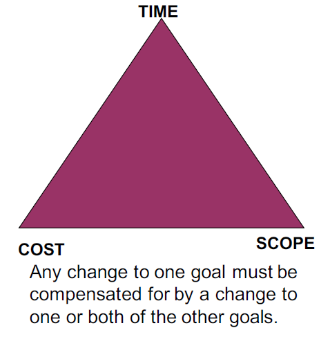
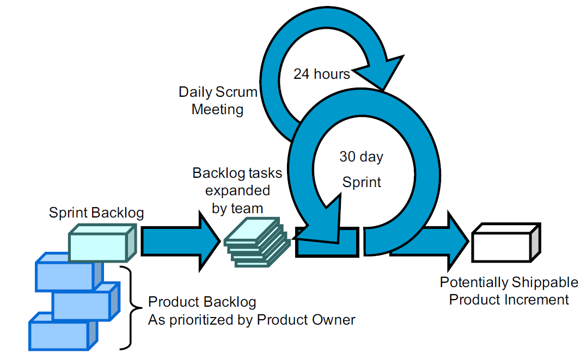
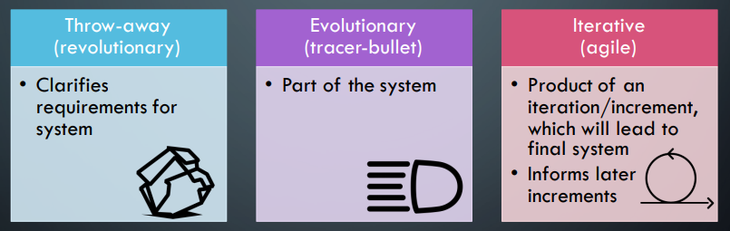

# Summary 
This is a summary of the content of ASD, I recommend reading through the other notes on this repository alongside this.

# Introduction
## Software Engineering (SE)
> establishment and use of effective engineering principles to create software that is reliable and works efficiently on real machines
> Application of a systematic, disciplined, quantifiable approach to the creation, operation and maintenance of software

### Elements of SE
* Requirement gathering
* Design
* Documentation
* Coding
* Testing
* Bug fixing

### Process of SE
* Definition
* Development
* Support

# Project Management
## Planning
* Project Scope
    * Defining scope
        * Narrative: narrative description of software based on what stakeholders say
        * Use cases: stories describing user interaction with software, from user POV
    * Determine feasibility
        * Given the scope, determine the resources required
    * Project Planning Goals
        * AKA Scope
        * Create measurable goals
            * S - Specific
            * M - Measurable
            * A - Agreed upon
            * R - Realistic
            * T - Time boxed
    * Deliverables - list of items to be delivered to meet goals
    * Schedule
        * Effort required (in terms of time)
        * If schedule is unrealistic you can do the following:
            * Renegotiate deadline
            * Additional resources
            * reduce scope
    * Supporting Plans
        * HR Plan
            * Name key individuals and organisations: describe roles and responsibilities 
        * Communication & Management Plan
            * Who needs to be informed about the project
            * How will they receive the information
                * Weekly review meeting
                * Progress reports
                * Revised schedule
        * Risk Management Plan
            * Identify as many risks as possible
            * Be prepared if something bad happens
        * Marketing Plan

* Management Activities
    * People
        * Managers, PM, Team Leads, Customers, End-users
    * Product
        * Scope/Decomposition
    * Process
        * SDLC
            * Initiation -> Analysis -> Design -> Construct -> Test -> Implement
        * UP
            * Inception -> Elaboration -> Construction -> Transition -> Production
    * Project
        * Size estimation, scheduling, risk management, tracking

> The 4 P's

* People
    * Roles and Responsibilities
        * Project Management
        * Systems Analysis
        * User Interface Designer
        * Architect
            * Middleware
        * Specialists
        * Documentation
    * Essential Roles
        1. Course Developer
        2. Database Designer
        3. Implementer
        4. Integrator
        5. Process Engineer
        6. Project Manager
        7. Project Reviewer
        8. Software Architect
        9. Systems Administrator
        10. Systems Analyst
        11. System Tester
        12. Test Manager
        13. UI Designer
    * Management and Team Success
        * Software Engineering is a group activity
        * Individual success depends:
            * Ability and interest to work hard etc
        * Team success depends on:
            * Ability to communicate and express ideas in the team
            * Group interaction is a key determinant of group performance
        * Management Skills

* Estimation and Metrics
    * Milestones and Deliverables
        * Activity - Task that takes time
            * Duration
            * Due date
            * Precursor
        * Milestone
            * Completion of an activity
            * Recognizable end-product of a task
            * Requires a formal output
        * Deliverable
            * A project result that is delivered to a customer
        * Milestone vs deliverable
            * Deliverable is a measurable and tangible outcome of the project. They are developed by project team members in alignment with the goals of the project
            * Milestones on the other hand are checkpoints throughout the life of the project. They identify when one or multiple groups of activities have been completed thus implying that a notable point has been reached in the project
    * Software Metric Characteristics
        * Process Metrics
            * Some aspect of the development process
        * Product Metrics
            * Some aspect of the software product
        * Result Metrics
            * Measure outcomes
        * Predictor Metrics
            * quantify estimates for project resource requirements
    * Are they worth anything?
        * Yes
        * Useful for prediction
        * Size metrics used for resource requirements
    * Why do we use them?
        * To plan and manage software development projects
## Scheduling
* Split the work in a project into separate tasks
* Network Analysis
    * Label tasks in order and indicate dependencies
    * Fill in earliest start, earliest finish
    * Fill in latest start, latest finish
    * Fill in total float
    * Fill in free float
* Gantt Charts
## Risks
* 3M's
    * Mitigation
    * Monitoring
    * Management
* Risk Matrix
    * Probability
    * Impact
* Boehm's Top Ten Risks
    1. Personnel shortfalls
    2. Unrealistic schedules and budgets
    3. Developing the wrong functions
    4. Developing the wrong user interfaces
    5. Gold-plating
    6. Continuing stream of requirements changes
    7. Shortfalls in externally-performed tasks
    8. Shortfalls in externally-furnished components
    9. Real-time performance shortfalls
    10. Straining computer science capabilities

## Planning vs Management
* Planning
    * Pre/Post
    * Network analysis, resourcing
* Management
    * During
    * Controlling resources and timescales
# PM Methods
## Triangle

## YAGNI - You Ain't Gonna Need It
* Build only what you need now
## Software Entropy
* Entropys is a measure of disorder in a physical system
* Software based entropy is the measure of code complexity
    * Tends to increase over time
## Yak Shaving
## Traditional SE MEthods
### Waterfall
* Analysis
* Requirement Specification
* Design
* Implementation
* Testing and Integration
* Operation and Maintenance

These all happen linearly
## Modern Alternatives
* More lightweight
* Iterative
* Agile Software Development
* Rapid Application Development
* Extreme Programming
* Scrum
# Agile Development
Agile is a set of values and principles
## Principles of Agile Methods
| Principle            | Description                                                     |
| --- | --- |
| Customer Involvement | Customers should be closely involved throughout the development process. Their role is to provide and prioritize new system requirements and to evaluate the iterations of the system |
| Incremental Delivery | The software is developed in increments with the customer specifying the requirements to be included in each increment.                                                               |
| People not process   | The skills of the development team should be recognized and exploited. Team members should be left to develop their own ways of working without prescriptive processes.               |
| Embrace Change       | Expect the system requirements to change and so design the system to accommodate these changes                                                                                        |
| Maintain Simplicity  | Focus on simplicity in both the software being developed and in the development process. Wherever possible, actively work to eliminate complexity from the system.                    |

## Guidelines of Agile Methods
1. Active user involvement is imperative
2. The team must be empowered to make decisions
3. Requirements evolve but the timescale is fixed
4. Capture requirements at a high level, lightweight and visual
5. Develop small, incremental releases and iterate
6. Focus on frequent delivery of product
7. Complete each feature before moving on to the next
8. Apply 80/20 rule
9. Testing is integrated throughout the project lifecycle - test early and often
10. A collaborative & cooperative approach between all stakeholders is essential

### Pareto's Law
* Typically 70% of your results come from 20% of your efforts

### Active User Involvement
* Requirements are clearly communicated and understood at the outset
* Requirements are prioritized appropriately, based on the needs of the user and market
* Requirements can be clarified daily with the project team, not from lengthy documents that are not read or are misunderstood
* Emerging requirements can be factored into the development schedule with the impact and trade-off decisions understood
* The right product is delivered
* As iterations are delivered, check they meet user expectations
* The product is more intuitive and easy to use
* The user is seen to be interested in the development
* The user/business sees the commitment of the team
* Developers are accountable, share progress openly every day
* There is complete transparency as there is nothing to hide
* The user shares responsibility for issues arising; it is not a customer-supplier relationship but a joint team effort
* Timely decisions can be made about features, priorities, issues, and when the product is ready
* Responsibility is shared; the team is responsible together for the delivery of the product
* When the going gets tough, the whole team - business and technical - work together!
## Fixed Timescale
* No-one knows what the right solution is at the outset
    * Its practically impossible to build the right solution initially
* Traditional project fight change, with change control processes
    * Minimise and resist change wherever possible
* Agile development embraces and expects change
    * The only thing that is certain in life is change
    * Requirements are allowed to evolve, but the timescale is fixed
        * To include a new requirement, or to change a requirement, the user must remove a comparable amount of work
    * Assumes there are enough non-mandatory features included in the original time frames
## Agile Requirements are Barely Sufficient
* Contrast this to the traditional situation
    * User still has new and changed requirements
        * Expects the new and existing features to be delivered in the original time frames
* Teams that don't control changes can end up with scope creep
    * One of the most common reasons for projects to fail
* Agile teams accept change and even expect it
## Agile Development Cycle
* Analyse, Develop, Test -> ADT
### Frequent Delivery 
* Agile development is about frequent delivery of products
    * Gone are 12 month projects
    * a 3-6 month project is strategic
* Consider web
    * Products are released early with basic features
    * In the web 2.0 its perpetual beta
        * derive some benefits early
        * get feedback
        * look at metrics -> find what works/doesn't
        * before building "everything"
### Regular Release Cycle
* Allows you to learn more effectively
* Estimates might be good or bad but they should be consistent
    * Estimate features at a granularity of less than 1 day and track your performance
    * You'll begin to understand your delivery rate
    * You'll be surprised at how predictable you can be
* Managing expectations is about predictability
    * If people know what to expect, they're generally happy
    * If they don't they're not happy
* Focus on frequent delivery of product
* Even more importantly, focus on consistent delivery
## eXtreme Programming (XP)
1. Whole Team: remove barrier between customer and the rest of the dev team
2. Metaphor: Common analogy for the system
3. Planning Game: planing specifies the next step
    * As the project progresses get a better and better picture of what will be accomplished
    * Client expresses goals through user stories - overall behaviour of the software
    * Development takes store is and estimates costs
    * Client prioritises stories
4. Simple design - as simple as the current level of functionality allows. No extraneous complexity allowed
    * When the code becomes too unwieldy its time for refactoring 
    * Design only extends to the next iterations new features
5. Small Releases: XP development teams release tested, working code, very frequently
    * Each iteration - 2 weeks - the client gets new code
    * Client evaluates it and dictates the next delivery
6. Consumer Test - The customer develops acceptance tests to see if software meets user stories
    * Tests are automated and used frequently by the developers
7. Pair Programming
8. Test Driven Development
9. Design Improvement - refactoring code whenever deficiencies are noticed = improving the design of the existing code
10. Collective code ownership: immaterial who wrote the code; anyone can modify it at any time
    * Whoever notices a problem, fixes it
11. Continuous Integration: At all times the system compiles, runs and passes all tests
12. Sustainable Pace: Same amount of work and effort in every iteration
    * Overtime leads to burnout, mistakes and more burnouts
13. Code standard - adopt some coding standard that is consistently adhered to

### Principles of XP
| Principle              | Description|
| --- | --- |
| Incremental planning   | Requirements are recorded on story cards and the stories to be included in a release are determined by the time available and their relative priority. The developers break these stories into development ‘Tasks’.                                                                          |
| Small releases         | The minimal useful set of functionality that provides business value is developed first. Releases of the system are frequent and incrementally add functionality to the first release.                                                                                                         |
| Simple Design          | Enough design is carried out to meet the current requirements and no more.                                                                                                                                                                                                                     |
| Test-First Development | An automated unit test framework is used to write tests for a new piece of functionality before that functionality itself is implemented                                                                                                                                                       |
| Refactoring            | All developers are expected to refactor the code continuously as soon as possible code improvements are found. This keeps the code simple and maintainable                                                                                                                                     |
| Pair programming       | Developers work in pairs, checking each other’s work and providing the support to always do a good job.                                                                                                                                                                                       |  |
| Collective ownership   | The pairs of developers work on all areas of the system, so no islands of expertise develop and all the developers take responsibility for all of the code: anyone can change anything.                                                                                                        |
| Continuous integration | As soon as the work on a task is complete, it is integrated into the whole system. After any such integration, all the unit tests in the system must pass.                                                                                                                                     |
| Sustainable pace       | Large amounts of overtime are not acceptable as the net effect is often to reduce code quality & medium term productivity                                                                                                                                                                      |
| On-site customer       | A representative of the end-user of the system (the customer) should be available full time for the use of the XP team. In an extreme programming process, the customer is a member of the development team and is responsible for bringing system requirements to the team for implementation |

### System Metaphor
* System metaphor is a mental model that everyone shares about the system and it shapes the architecture of the system

## TDD
* Programming technique ensuring that code is thoroughly unit tested if a test fails then progress has been made: you know what to fix
    * Clear measure of success when the test no longer fails
* TDD increases confidence that the system meets the requirements
* Side effect of TDD is you achieve 100% coverage test
    * Every single line of code is tested
    * Not guaranteed with traditional testing
* Does not replace traditional testing: just effective unit testing
* Side effective of TDD: the resulting tests are working examples for invoking the code -> provides a working spec for the code

# Scrum
## Roles
1. Product Owner
2. Team
3. Scrum Master (SM)
* All involved are Players or Spectators
    * Players       -   committed, accountable, responsible
    * Spectators    -   interested, consults, informed (management)

## Sprints
* Sprints are times that work is done.
### Sprint Meeting
* First four hours deciding what to do
* Second four hours planning sprint

### Daily Scrum
* 15 minutes
* 3 Questions
    1. What have you done
    2. What will you do
    3. What stands in the way of meeting requirements of the sprint

### Retrospective
* What went well last sprint?
* What could be improved in the next sprint?

### Artefacts
* Product Backlog
* Sprint Backlog
* Burndown chart

# Prototypes
* Horizontal Prototype - wide range of functions, very little detail on each
* Vertical Prototype - small range of functions, a lot of detail
* Throw Away Prototype - Address high-risk issues, only enough effort to help address specific issues - for trying alternative ideas
* Evolutionary Prototypes - intended to be early version of the actual software

