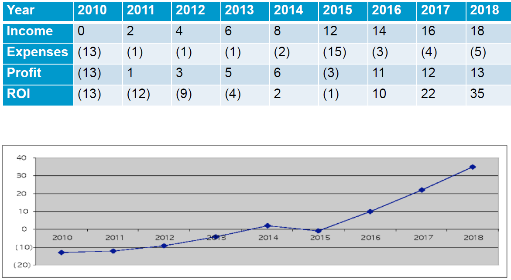
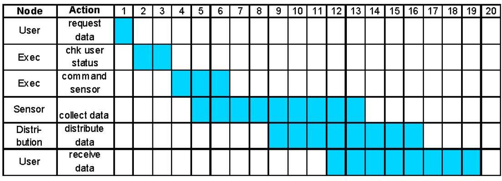
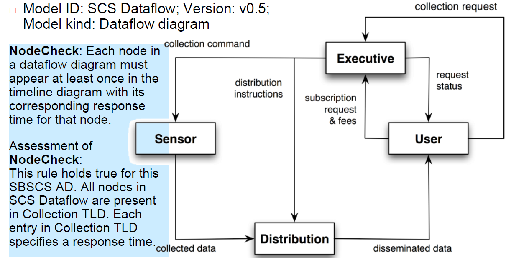

## Lecture 12
### Architecture Description
#### Architecture Diagram
* The Architecture Diagram provides a graphical view of the major components in the system, and the relationships between them.
* Conceptual architecture diagram communicates with various stakeholders (e.g.: management, project managers for team/individual work assignments, developers and customers or users)
    * Provides a high-level view useful to non-technical audiences;
    * Summarizes the entire system for technical audiences
* Use any appropriate UML subset (even class diagrams)
* Remember the point is capturing and conveying the information; not providing the perfect UML
#### Subscription-Based Sensor Collection Service (SBSCS)
* The *hello world* equivalent of an architecture description conforming to ISO/IEC 42010 - which you can find [here](http://www.iso-architecture.org/ieee-1471/docs/SBSCS-AD-v02.pdf)
* I downloaded the file, and the summary from the lecture slides - which you can find:
    * [SBSCS](docs/SBSCS.pdf)
    * [SBSCS Lecture Slides](docs/SBSCSLecture.pdf)
* Although, to summarize (some more) here is the a brief outline. There is a:
    * Architecture Description Identification, which contains the following information:
        * Version
        * Date of issue and status
        * Issuing organization
        * Change history
        * Summary
        * Scope
        * Context
        * Glossary
        * Results from evaluations
        * References
    * System Stakeholder and Concerns
        * Consider/Identify:
            * Users of the system
            * Operators of the system
            * Developers of the system
        * Outline the stakeholder and what concerns they have
    * There are three viewpoints: FVP, OVP and SVP
        * FVP - Financial Viewpoint
            * Shows ROI and justifies investment by the operator in project over time

        * OVP - Operational Viewpoint
            * Is used to show the required budgets of key operations to insure achieving timely delivery of data
        * SVP - System Viewpoint
            * Used to show overall data flow between system nodes
    * From those viewpoints you get the following views:
        * Financial view:
            * Profit statement
            * Profitability curve
            * 
        * Operational View
            * Timeline diagram
            * 
        *  System View
            *  Shows system nodes, dataflow between them
            *  Dataflow diagram
            *  
### Guidelines
#### How to partition the domain model
* Place elements together that
    * Are in the same subject area - closely related by concept or purpose
    * Are in a class hierarchy together
    * Participate in the same use cases
    * Are strongly associated
#### Architecture Analysis
* Start Architectural Analysis before the first cycle
    * Can start early iterations before architectural analysis is complete
* It is mainly concerned with non-functional requirements
    * *quality attributes* ([Bennet](docs/BennetChapter22.pdf))
    * e.g.: security
* Within the context of the functional requirements
    * E.g.: processing sales
* Examples of issues to be identified and resolved:
    * How do reliability and fault-tolerance requirements affect the design?
    * How do the licensing costs of purchased subcomponents affect profitability?
    * How do the the adaptability and configurability requirements affect the design?
#### Common Steps in Architectural Analysis
1. Identify and Analyze the non-functional requirements that have an impact on the architecture
    * Architectural factors (or drivers)
2. For those requirements with a significant architectural impact, analyze alternatives and create solutions that resolve the impact
    * Architectural decisions
#### Identification and analysis of architectural factors
* Quality Scenarios
    * Form: ```<stimulus> <measurable response>```
    * Record non-functional architectural factors in a measurable form
* Example:
    * When the completed sale is sent to the remote tax calculator to add the taxes, the result is returned within 2 seconds "most" of the time, measured in a production environment under "average" load conditions.
    * When a bug-report arrives from a test volunteer, reply with a phone call within 1 working day
* no point in describing scenarios that will never be tested before shipping
#### Conclusion
* The basic architectural design principles are:
    * **Low couping**
    * **High Cohesion**
    * **Separation of concerns** and **localization of impact**
* One *could* design persistence support such that each object also communicated with a database to save its data
    * The concern of persistence is then mixed in with the concern of application logic
    * and same with security etc
> Cohesion drops and coupling rises
* Recommend: factor out persistence, security
    * Object with application just has application logic
    * Persistence subsystem focuses on the concern of persistence,
    * Security subsystem doesn't do persistence